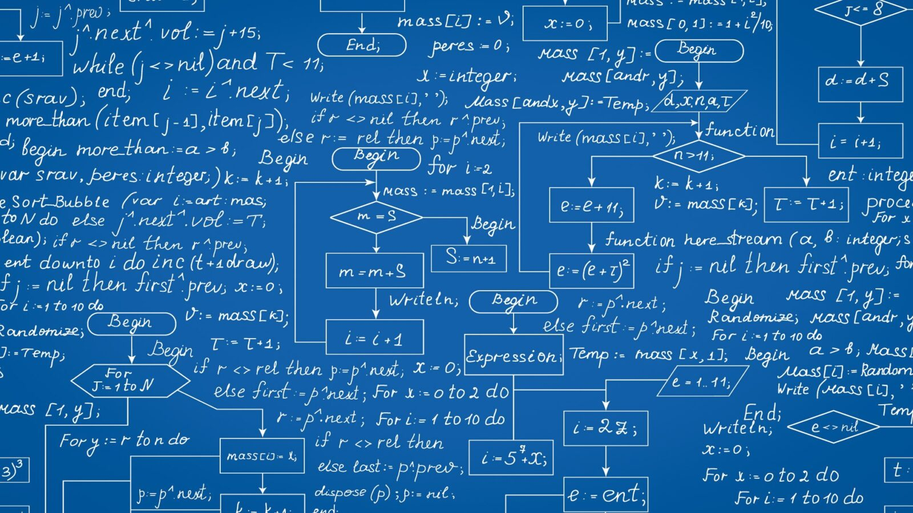
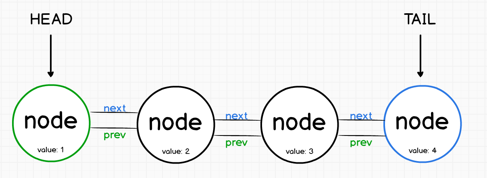

# Introduction to Data Structures - Part I

Authors: **Fatih Semiz - Kaan Keskin**

Date: July 2021

Available at (Source): https://github.com/fsemiz/Introduction-To-Data-Structures

Available at (Forked): https://github.com/kaan-keskin/Introduction-To-Data-Structures

Java Collections Framework Benchmark Tool: https://github.com/kaan-keskin/java-collections-benchmark

**Resources:**

- Introduction to Algorithms - Cormen, Leiserson, Rivest, Stein
- Algorithms - Sanjoy Dasgupta, Christos Papadimitriou, Umesh Vazirani
- Data Structures and Algorithms with Python - Kent D. Lee, Steve Hubbard
- Grokking Algorithms - Aditya Y. Bhargava
- Wikipedia - www.wikipedia.com

## Introduction
To solve a problem in the world of computer science and normal life, we must first make a plan and determine the solution steps. This can be likened to looking at a recipe before cooking. To make a computer perform a task, we need to provide more details. Technically speaking an algorithm can be defined as the following: "Finite sequence of instructions to perform a specific task in a finite amount of time". The basis of creating a good algorithm for many problems lies in storing the data to be used appropriately and efficiently. By saying efficient we generally talk about **accessing**, **insertion**, **deletion**, **searching**, and **sorting** the data. These operations complexities are directly related to which container is used to store that data.

|  |
|:--:|
| *Retrieved from https://www.techidence.com/whats-an-algorithm-understand-how-it-works-in-apps-and-websites/* |

To put it briefly, data structures are containers used to store data. However, each data structure is generally built to store a certain type of data. A data structure may be efficient in some operations but inefficient in other operations, and this is often the case. For this reason, we must choose data structures in accordance with the data at hand. For example, if you try to drink a soup with a fork, it will take you quite a while to finish it. However, if you use a spoon for soup and a fork for pasta, you will see that you can eat both fast this time. The purpose of this session will be to go over the topics of data structures as well as to remind you where and what type of data structures are used in which situation.

|  |
| :----------------------------------------------------------: |
| *Retrieved from https://www.linkedin.com/pulse/eating-soup-forks-michael-henderson/* |

## Basic Data Structures: Arrays and Linked Lists

### Array Data Structure

    Array: Contiguous area of memory consisting of equal-size elements indexed by contiguous integers.

In computer science, an array data structure, or simply an array, is a data structure consisting of a collection of elements (values or variables), each identified by at least one array index or key. An array is stored such that the position of each element can be computed from its index tuple by a mathematical formula. The simplest type of data structure is a linear array, also called one-dimensional array. 

The key point about an array is we have constant time access to read and write, O(1) operation.

    constant_time_access = array_addr + element_size x (i - first_index)

For example, an array of 10 32-bit (4-byte) integer variables, with indices 0 through 9, may be stored as 10 words at memory addresses 2000, 2004, 2008, ..., 2036, (in hexadecimal: 0x7D0, 0x7D4, 0x7D8, ..., 0x7F4) so that the element with index i has the address 2000 + (i × 4).

|  |
|:--:|
| *Retrieved from https://beginnersbook.com/2018/10/data-structure-array/* |

The memory address of the first element of an array is called first address, foundation address, or base address.

**Arrays are among the oldest and most important data structures, and are used by almost every program. They are also used to implement many other data structures, such as lists and strings.** 

They effectively exploit the addressing logic of computers. In most modern computers and many external storage devices, the memory is a one-dimensional array of words, whose indices are their addresses. Processors, especially vector processors, are often optimized for array operations.

**Arrays are useful mostly because the element indices can be computed at run time. Among other things, this feature allows a single iterative statement to process arbitrarily many elements of an array.** 

**For that reason, the elements of an array data structure are required to have the same size and should use the same data representation.** 

The set of valid index tuples and the addresses of the elements (and hence the element addressing formula) are usually, but not always, fixed while the array is in use.

**The term array is often used to mean array data type, a kind of data type provided by most high-level programming languages that consists of a collection of values or variables that can be selected by one or more indices computed at run-time. Array types are often implemented by array structures; however, in some languages they may be implemented by hash tables, linked lists, search trees, or other data structures.**

#### Running Times for Common Operations in Arrays

| Location | Add (Create) | Remove (Delete) | Read | Write (Update) |
| :--: | :--: | :--: | :--: | :--: |
| Beginning | O(n) | O(n) | O(1) | O(1) |
| End | O(1) | O(1) | O(1) | O(1) |
| Middle | O(n) | O(n) | O(1) | O(1) |

**AddEnd(value)**: We just add it, then update the number of elements that are in use. That's an O(1) operation.

**RemoveEnd()**: As well, that's an O(1) operation. Because we just update the number of elements that are in use.

**RemoveBeginning()**: Where it's get to be expensive, if we want to remove the first element. So we remove the first element, then we need to move all elements to the left (or down). That's an O(n) operation.

**AddBeginning(value)**: I we want to insert at the beginning, we need to move every element to the right (or up), then insert the element at the beginning.

Arrays are great if you want to add or remove element at the end. But it's expensive if you want to add or remove in the middle or at the beginning.

However, a huge advantage for arrays is that we have constant time access to elements either read or write.

#### Arrays in Java Programming Language

Java provides a data structure, the array, which stores a fixed-size sequential collection of elements of the same type. 

An array is used to store a collection of data, but it is often more useful to think of an array as a collection of variables of the same type.

##### Declaring Array Variables

To use an array in a program, you must declare a variable to reference the array, and you must specify the type of array the variable can reference.

**Syntax:**

```Java
dataType[] arrayRefVar;   // preferred way.

dataType arrayRefVar[];  // works but not preferred way.
```

**The following code snippets are examples of this syntax:**

```Java
double[] myList;   // preferred way.

double myList[];   // works but not preferred way.
```

##### Creating Arrays

You can create an array by using the new operator with the following syntax:

```Java
arrayRefVar = new dataType[arraySize];
```

The above statement does two things:

- It creates an array using new dataType[arraySize].
  
- It assigns the reference of the newly created array to the variable arrayRefVar.

Declaring an array variable, creating an array, and assigning the reference of the array to the variable can be combined in one statement, as shown below:

```Java
dataType[] arrayRefVar = new dataType[arraySize];
```

##### Example

Following statement declares an array variable, myList, creates an array of 10 elements of double type and assigns its reference to myList:

```Java
double[] myList = new double[10];
```

Following picture represents array myList. Here, myList holds ten double values and the indices are from 0 to 9.

|  |
|:--:|
| *Retrieved from https://www.tutorialspoint.com/java/java_arrays.htm* |

#### Lists in Python Programming Language

A list in Python is a collection of items which can contain elements of multiple data types, which may be either numeric, character logical values, etc. It is an ordered collection supporting negative indexing. A list can be created using [] containing data values. 

Contents of lists can be easily merged and copied using python’s inbuilt functions.

```Python
# creating a list containing elements 
# belonging to different data types
>>> sample_list = [1,"Yash",['a','e']]
>>> print(sample_list)
[1, 'Yash', ['a', 'e']]
```

| Operation | Complexity | Usage | Method |
| :--: | :--: | :--: | :--: |
| List creation | O(n) or O(1) | x = list(y) | calls \_\_init\_\_(y) |
| indexed get | O(1) | a = x[i] | x.\_\_getitem\_\_(i) |
| indexed set | O(1) | x[i] = a | x.\_\_setitem\_\_(i,a) |
| concatenate | O(n) | z=x+y  | z = x.\_\_add\_\_(y) |
| append | O(1) | x.append(a) | x.append(a) |
| insert | O(n) | x.insert(i,e) | x.insert(i,e) |
| delete | O(n) | del x[i] | x.\_\_delitem\_\_(i) |
| equality | O(n) | x == y | x.\_\_eq\_\_(y) |
| iterate | O(n) | for a in x: | x.\_\_iter\_\_() |
| length | O(1) | len(x) | x.\_\_len\_\_() |
| membership | O(n) | a in x | x.\_\_contains\_\_(a) |
| sort | O(n log n) | x.sort() | x.sort() |

Each of the operations in the table has an associated complexity. 

The performance of an algorithm depends on the complexity of the operations used in implementing that algorithm. 

The indexed get and indexed set operations can be observed to have O(1) complexity. This complexity is achieved because the memory of a computer is randomly accessible, which is why it is called Random Access Memory.

**Additional Information:**

Python's List is a dynamic array. This is implementation dependent for each Python Interpreter:

- CPython uses an array of pointers
- Jython uses an ArrayList
- IronPython also uses an array. 

You can browse the source code to find out. Thus they all have O(1) random access.

#### Arrays in Python Programming Language

An array is a vector containing homogeneous elements i.e. belonging to the same data type. Elements are allocated with contiguous memory locations allowing easy modification, that is, addition, deletion, accessing of elements. 

In Python, we have to use the array module to declare arrays. If the elements of an array belong to different data types, an exception “Incompatible data types” is thrown.

Python’s array module provides space-efficient storage of basic C-style data types like bytes, 32-bit integers, floating point numbers, and so on.

Arrays created with the **array.array class** are **mutable** and behave similarly to lists, except for one important difference — they are “**typed arrays**” constrained to a single data type.

Because of this constraint, array.array objects with many elements are more space-efficient than lists and tuples. The elements stored in them are tightly packed, and this can be useful if we need to store many elements of the same type.

Also, arrays support many of the same methods as regular lists, and we might be able to use them as a “drop-in replacement” without requiring other changes to our application code.

```Python
>>> import array
>>> arr = array.array('i', (22, 30, 10, 6))
>>> arr[1]
30 # Arrays are mutable
>>> arr[1] = 25
>>> arr
array('i', [22, 25, 10, 6])
>>> arr.append(27)
>>> arr
array('i', [22, 25, 10, 6, 27]) # Arrays are typed
>>> arr[1] = "Sarah"
TypeError: an integer is required (got type str)
```

#### NumPy (Numerical Python) Arrays in Python Programming Language

The NumPy (Numerical Python) library first appeared in 2006 and is the preferred Python array implementation. 

**It offers a high-performance, richly functional n-dimensional array type called ndarray**, which from this point forward we’ll refer to by its synonym, array.

**Operations on array s are up to two orders of magnitude faster than those on lists.**

In a big-data world in which applications may do massive amounts of processing on vast amounts of array-based data, this performance advantage can be critical.

A strength of NumPy is “array-oriented programming,” which uses functional-style programming with internal iteration to make array manipulations concise and straightforward, eliminating the kinds of bugs that can occur with the external iteration of explicitly programmed loops.

The NumPy documentation recommends importing the numpy module as np so that you can access its members with "**np.**":

```Python
>>> import numpy as np

>>> numbers = np.array([2, 3, 5, 7, 11])
>>> numbers = np.array([x for x in range(2, 21, 2)])
>>> numbers = np.array([[2, 4, 6, 8, 10], [1, 3, 5, 7, 9]])
```

#### List vs. Array Performance in Python Programming Language

**Most array operations execute significantly faster than corresponding list operations.**

To demonstrate, we’ll use the **IPython %timeit** **magic command**, which times the average duration of operations. Note that the times displayed on your system may vary from what we show here.

**Timing the Creation of a List Containing Results of 6,000,000 Die Rolls:**

```Python
>>> import random

>>> %timeit rolls_list = [random.randrange(1, 7) for i in range(0, 6_000_000)]

6.29 s ± 119 ms per loop (mean ± std. dev. of 7 runs, 1 loop each)
```

By default, %timeit executes a statement in a loop, and it runs the loop seven times. If you do not indicate the number of loops, %timeit chooses an appropriate value. 

In our testing, operations that on average took more than 500 milliseconds iterated only once, and operations that took fewer than 500 milliseconds iterated 10 times or more. After executing the statement, %timeit displays the statement’s average execution time, as well as the standard deviation of all the executions. On average, %timeit indicates that it took 6.29 seconds ( s ) to create the list with a standard deviation of 119 milliseconds ( ms ). In total, the preceding snippet took about 44 seconds to run the snippet seven times.

**Timing the Creation of an array Containing Results of 6,000,000 Die Rolls:**

Now, let’s use the randint function from the numpy.random module to create an array of 6,000,000 die rolls.

```Python
>>> import numpy as np

>>> %timeit rolls_array = np.random.randint(1, 7, 6_000_000)

72.4 ms ± 635 μs per loop (mean ± std. dev. of 7 runs, 10 loops each)
```

On average, %timeit indicates that it took only 72.4 milliseconds with a standard deviation of 635 microseconds ( μs ) to create the array. 

**In total, the preceding snippet took just under half a second to execute on our computer—about 1/100th of the time snippet took to execute. The operation is two orders of magnitude faster with array!**

#### Differences Between Arrays and Lists in Python

Now that we know their definitions and features, we can talk about the differences between lists and arrays in Python:

- Arrays need to be declared. Lists don't, since they are built into Python. In the examples above, you saw that lists are created by simply enclosing a sequence of elements into square brackets. Creating an array, on the other hand, requires a specific function from either the array module (i.e., array.array()) or NumPy package (i.e., numpy.array()). Because of this, lists are used more often than arrays.

- Arrays can store data very compactly and are more efficient for storing large amounts of data.

- Arrays are great for numerical operations; lists cannot directly handle math operations. For example, you can divide each element of an array by the same number with just one line of code. If you try the same with a list, you'll get an error.

So, when should you use a list and when should you use an array?

- If you need to store a relatively short sequence of items and you don't plan to do any mathematical operations with it, a list is the preferred choice. This data structure will allow you to store an ordered, mutable, and indexed sequence of items without importing any additional modules or packages.

- If you have a very long sequence of items, consider using an array. This structure offers more efficient data storage.

- If you plan to do any numerical operations with your combination of items, use an array. Data analytics and data science rely heavily on (mostly NumPy) arrays.

#### pandas Series and DataFrames in Python Programming Language

NumPy’s array is optimized for homogeneous numeric data that’s accessed via integer indices. 

**Data science presents unique demands for which more customized data structures are required. Big data applications must support mixed data types, customized indexing, missing data, data that’s not structured consistently and data that needs to be manipulated into forms appropriate for the databases and data analysis packages you use.**

Pandas is the most popular library for dealing with such data. It provides two key collections: Series for one-dimensional collections and DataFrame's for two-dimensional collections. You can use pandas’ MultiIndex to manipulate multi-dimensional data in the context of Series and DataFrame's.

**Wes McKinney** created pandas in **2008** while working in industry. The name **pandas** is derived from the term “**panel data**”, which is data for measurements over time, such as stock prices or historical temperature readings. McKinney needed a library in which the same data structures could handle both time- and non-time-based data with support for data alignment, missing data, common database-style data manipulations, and more.

##### pandas Series

**A Series is an enhanced one-dimensional array. Whereas arrays use only zero-based integer indices, Series support custom indexing, including even non-integer indices like strings.** 

```Python
>>> import pandas as pd

>>> grades = pd.Series([87, 100, 94])
>>> grades
0     87
1    100
2     94
dtype: int64

>>> pd.Series([87, 100, 94], index=['Wally', 'Eva', 'Sam'])
Wally     87
Eva      100
Sam       94
dtype: int64

>>> pd.Series({'Wally': 87, 'Eva': 100, 'Sam': 94})
Wally     87
Eva      100
Sam       94
dtype: int64

>>> pd.Series([1, 2, None, 'kaan'])
0       1
1       2
2    None
3    kaan
dtype: object

```

##### pandas DataFrames

DataFrame is an enhanced two-dimensional array . Like Series, DataFrames can have custom row and column indices, and offer additional operations and capabilities that make them more convenient for many data-science oriented tasks. 

DataFrames also support missing data. Each column in a DataFrame is a Series. The Series representing each column may contain different element types.

```Python
>>> import pandas as pd

>>> grades_dict = {'Wally': [87, 96, 70], 'Eva': [100, 87, 90],
    ...: 'Sam': [94, 77, 90], 'Katie': [100, 81, 82],
    ...: 'Bob': [83, 65, 85]}
>>> grades = pd.DataFrame(grades_dict)
>>> grades
   Wally  Eva  Sam  Katie  Bob
0     87  100   94    100   83
1     96   87   77     81   65
2     70   90   90     82   85
>>> grades.index = ['Test1', 'Test2', 'Test3']
>>> grades
       Wally  Eva  Sam  Katie  Bob
Test1     87  100   94    100   83
Test2     96   87   77     81   65
Test3     70   90   90     82   85
```

### Linked Lists

**In computer science, a linked list is a linear collection of data elements whose order is not given by their physical placement in memory. Instead, each element points to the next.**

**It is a data structure consisting of a collection of nodes which together represent a sequence. In its most basic form, each node contains: data, and a reference (in other words, a link) to the next node in the sequence.** 

This structure allows for efficient insertion or removal of elements from any position in the sequence during iteration. More complex variants add additional links, allowing more efficient insertion or removal of nodes at arbitrary positions. 

A drawback of linked lists is that access time is linear (and difficult to pipeline). Faster access, such as random access, is not feasible. Arrays have better cache locality compared to linked lists.

|  |
| :----------------------------------------------------------: |
| *Retrieved from https://msatechnosoft.in/blog/linked-list-implementatio-types-singly-doubly-circular-example-with-code/* |

Linked lists are among the simplest and most common data structures. **They can be used to implement several other common abstract data types, including lists, stacks, queues, associative arrays, and S-expressions, though it is not uncommon to implement those data structures directly without using a linked list as the basis.**

The principal benefit of a linked list over a conventional array is that the list elements can be easily inserted or removed without reallocation or reorganization of the entire structure because the data items need not be stored contiguously in memory or on disk, while restructuring an array at run-time is a much more expensive operation. 

Linked lists allow insertion and removal of nodes at any point in the list, and allow doing so with a constant number of operations by keeping the link previous to the link being added or removed in memory during list traversal.

On the other hand, since simple linked lists by themselves do not allow random access to the data or any form of efficient indexing, many basic operations—such as obtaining the last node of the list, finding a node that contains a given datum, or locating the place where a new node should be inserted—may require iterating through most or all of the list elements. 

Linked lists are dynamic, so the length of a linked list can increase or decrease as necessary. Each node does not necessarily follow the previous one physically in the memory.

#### Linear Data Structures

**One characteristic of linked lists is that they are linear data structures, which means that there is a sequence and an order to how they are constructed and traversed.**

We can think of a linear data structure like a game of hopscotch: in order to get to the end of the list, we have to go through all of the items in the list in order, or sequentially. 

Linear structures, however, are the opposite of non-linear structures. **In non-linear data structures, items don’t have to be arranged in order, which means that we could traverse the data structure non-sequentially.**

|  |
| :----------------------------------------------------------: |
| *Retrieved from https://medium.com/basecs/whats-a-linked-list-anyway-part-1-d8b7e6508b9d* |

#### Memory Management

The biggest differentiator between arrays and linked lists is the way that they use memory in our machines. 

When an array is created, it needs a certain amount of memory. If we had 7 letters that we needed to store in an array, we would need 7 bytes of memory to represent that array. But, we’d need all of that memory in one contiguous block. That is to say, our computer would need to locate 7 bytes of memory that was free, one byte next to the another, all together, in one place.

On the other hand, when a linked list is born, it doesn’t need 7 bytes of memory all in one place. One byte could live somewhere, while the next byte could be stored in another place in memory altogether! Linked lists don’t need to take up a single block of memory; instead, the memory that they use can be scattered throughout.

**The fundamental difference between arrays and linked lists is that arrays are static data structures, while linked lists are dynamic data structures.**

A static data structure needs all of its resources to be allocated when the structure is created; this means that even if the structure was to grow or shrink in size and elements were to be added or removed, it still always needs a given size and amount of memory. If more elements needed to be added to a static data structure and it didn’t have enough memory, you’d need to copy the data of that array, for example, and recreate it with more memory, so that you could add elements to it.

On the other hand, a dynamic data structure can shrink and grow in memory. It doesn’t need a set amount of memory to be allocated in order to exist, and its size and shape can change, and the amount of memory it needs can change as well.

|  |
|:--:|
| *Retrieved from https://medium.com/basecs/whats-a-linked-list-anyway-part-1-d8b7e6508b9d* |

#### Basic Concepts and Nomenclature

**Each record of a linked list is often called an 'element' or 'node'.**

The field of each node that contains the address of the next node is usually called the 'next link' or 'next pointer'. The remaining fields are known as the 'data', 'information', 'value', 'cargo', or 'payload' fields.

**The 'head' of a list is its first node.** 

**The 'tail' of a list may refer either to the rest of the list after the head, or to the last node in the list.** 

|  |
| :----------------------------------------------------------: |
| *Retrieved from https://www.codecademy.com/learn/linear-data-structures-java/modules/singly-linked-lists-java/cheatsheet* |

#### Linked List API

The operations provided from the Linked List are given the table below:

| Method Name | Explanation |
| :--: | :--: |
| PushFront(key) | add to front |
| TopFront() | return front item |
| PopFront() | remove front item |
| PushBack(key) | add to back |
| TopBack() | return back item |
| PopBack() | remove back item |
| Find(key) | is key in list? |
| Erase(key) | remove key from list |
| Empty() | empty list? |
| AddBefore(node,key) | adds key before node |
| AddAfter(node,key) | adds key after node |

#### Removing a node from the middle of a linked list

When removing a node from the middle of a linked list, it is necessary to adjust the link on the previous node so that it points to the following node. In the given illustration, the node a1 must point to the node a3 if the node a2 is removed from the linked list.

|  |
| :----------------------------------------------------------: |
| *Retrieved from https://www.codecademy.com/learn/linear-data-structures-java/modules/singly-linked-lists-java/cheatsheet* |

#### Adding a new head node in a linked list

When adding a new node to the start of a linked list, it is necessary to maintain the list by giving the new head node a link to the current head node. For instance, to add a new node a0 to the begining of the linked list, a0 should point to a1.

|  |
| :----------------------------------------------------------: |
| *Retrieved from https://www.codecademy.com/learn/linear-data-structures-java/modules/singly-linked-lists-java/cheatsheet* |

#### Singly-Linked List

Singly linked lists contain nodes which have a data field as well as 'next' field, which points to the next node in line of nodes. 

Singly-Linked List Node Contains:
- key
- next pointer

|  |
|:--:|
| *Retrieved from https://msatechnosoft.in/blog/linked-list-implementatio-types-singly-doubly-circular-example-with-code/* |

#### Running Times for Common Operations in Singly-Linked List

| Singly-Linked List API | No Tail Pointer | With Tail Pointer |
| :--: | :--: | :--: |
| PushFront(key) | O(1) | O(1) |
| TopFront() | O(1) | O(1) |
| PopFront() | O(1) | O(1) |
| PushBack(key) | **O(n)** | **O(1)** |
| TopBack() | **O(n)** | **O(1)** |
| PopBack() | O(n) | O(n) |
| Find(key) | O(n) | O(n) |
| Erase(key) | O(n) | O(n) |
| Empty() | O(1) | O(1) |
| AddBefore(node,key) | O(n) | O(n) |
| AddAfter(node,key) | O(n) | O(n) |

#### Doubly-Linked List

In a doubly linked list, each node contains, besides the next-node link, a second link field pointing to the **previous** node in the sequence. The two links may be called **forward('s')** and **backwards**, or **next** and **prev** (**previous**). 

Doubly-Linked List Node Contains:
- key
- next pointer
- previous pointer

|  |
|:--:|
| *Retrieved from https://msatechnosoft.in/blog/linked-list-implementatio-types-singly-doubly-circular-example-with-code/* |

#### Running Times for Common Operations in Doubly-Linked List

| Doubly-Linked List API | No Tail Pointer | With Tail Pointer |
| :--: | :--: | :--: |
| PushFront(key) | O(1) | O(1) |
| TopFront() | O(1) | O(1) |
| PopFront() | O(1) | O(1) |
| PushBack(key) | **O(n)** | **O(1)** |
| TopBack() | **O(n)** | **O(1)** |
| PopBack() | **O(1)** | **O(1)** |
| Find(key) | O(n) | O(n) |
| Erase(key) | O(n) | O(n) |
| Empty() | O(1) | O(1) |
| AddBefore(node,key) | **O(1)** | **O(1)** |
| AddAfter(node,key) | O(n) | O(n) |

#### Implementing a Singly-Linked List in Java Programming Language

Like arrays, Linked List is a linear data structure. Unlike arrays, linked list elements are not stored at the contiguous location, the elements are linked using pointers.

In Java, LinkedList can be represented as a class and a Node as a separate class. The LinkedList class contains a reference of Node class type.

```Java
import java.io.*;
 
// Java program to implement a Singly Linked List without a tail pointer
public class LinkedList {
 
    Node head; // head of list
 
    // Linked list Node.
    // Node is a static nested class so main() can access it
    static class Node {
 
        int data; // Type of the data stored in the node
        Node next;
 
        // Constructor
        Node(int d)
        {
            data = d;
            next = null;
        }
    }
 
    // **************INSERTION**************
 
    // Method to insert a new node
    public static LinkedList insert(LinkedList list, int data)
    {
        // Create a new node with given data
        Node new_node = new Node(data);
        new_node.next = null;
 
        // If the Linked List is empty,
        // then make the new node as head
        if (list.head == null) {
            list.head = new_node;
        } else {
            // Else traverse till the last node
            // and insert the new_node there
            Node last = list.head;
            while (last.next != null) {
                last = last.next;
            }
 
            // Insert the new_node at last node
            last.next = new_node;
        }
 
        // Return the list by head
        return list;
    }
 
    // **************TRAVERSAL**************
 
    // Method to print the LinkedList.
    public static void printList(LinkedList list)
    {
        Node currNode = list.head;
 
        System.out.print("\nLinkedList: ");
 
        // Traverse through the LinkedList
        while (currNode != null) {
            // Print the data at current node
            System.out.print(currNode.data + " ");
 
            // Go to next node
            currNode = currNode.next;
        }
        System.out.println("\n");
    }
 
    // **************DELETION BY KEY**************
 
    // Method to delete a node in the LinkedList by KEY
    public static LinkedList deleteByKey(LinkedList list,
                                         int key)
    {
        // Store head node
        Node currNode = list.head, prev = null;
 
        //
        // CASE 1:
        // If head node itself holds the key to be deleted
 
        if (currNode != null && currNode.data == key) {
            list.head = currNode.next; // Changed head
 
            // Display the message
            System.out.println(key + " found and deleted");
 
            // Return the updated List
            return list;
        }
 
        //
        // CASE 2:
        // If the key is somewhere other than at head
        //
 
        // Search for the key to be deleted,
        // keep track of the previous node
        // as it is needed to change currNode.next
        while (currNode != null && currNode.data != key) {
            // If currNode does not hold key
            // continue to next node
            prev = currNode;
            currNode = currNode.next;
        }
 
        // If the key was present, it should be at currNode
        // Therefore the currNode shall not be null
        if (currNode != null) {
            // Since the key is at currNode
            // Unlink currNode from linked list
            prev.next = currNode.next;
 
            // Display the message
            System.out.println(key + " found and deleted");
        }
 
        //
        // CASE 3: The key is not present
        //
 
        // If key was not present in linked list
        // currNode should be null
        if (currNode == null) {
            // Display the message
            System.out.println(key + " not found");
        }
 
        // return the List
        return list;
    }
 
    // **************DELETION AT A POSITION**************
 
    // Method to delete a node in the LinkedList by POSITION
    public static LinkedList
    deleteAtPosition(LinkedList list, int index)
    {
        // Store head node
        Node currNode = list.head, prev = null;
 
        //
        // CASE 1:
        // If index is 0, then head node itself is to be
        // deleted
 
        if (index == 0 && currNode != null) {
            list.head = currNode.next; // Changed head
 
            // Display the message
            System.out.println(
                index + " position element deleted");
 
            // Return the updated List
            return list;
        }
 
        //
        // CASE 2:
        // If the index is greater than 0 but less than the
        // size of LinkedList
        //
        // The counter
        int counter = 0;
 
        // Count for the index to be deleted,
        // keep track of the previous node
        // as it is needed to change currNode.next
        while (currNode != null) {
 
            if (counter == index) {
                // Since the currNode is the required
                // position Unlink currNode from linked list
                prev.next = currNode.next;
 
                // Display the message
                System.out.println(
                    index + " position element deleted");
                break;
            }
            else {
                // If current position is not the index
                // continue to next node
                prev = currNode;
                currNode = currNode.next;
                counter++;
            }
        }
 
        // If the position element was found, it should be
        // at currNode Therefore the currNode shall not be
        // null
        //
        // CASE 3: The index is greater than the size of the
        // LinkedList
        //
        // In this case, the currNode should be null
        if (currNode == null) {
            // Display the message
            System.out.println(
                index + " position element not found");
        }
 
        // return the List
        return list;
    }
}
```

Usage of implemented LinkedList class:

```Java
    // **************MAIN METHOD**************
 
    // method to create a Singly-Linked List with n nodes
    public static void main(String[] args)
    {
        /* Start with the empty list. */
        LinkedList list = new LinkedList();
 
        //
        // ******INSERTION******
        //
 
        // Insert the values
        list = insert(list, 1);
        list = insert(list, 2);
        list = insert(list, 3);
        list = insert(list, 4);
        list = insert(list, 5);
        list = insert(list, 6);
        list = insert(list, 7);
        list = insert(list, 8);
 
        // Print the LinkedList
        printList(list);
 
        //
        // ******DELETION BY KEY******
        //
 
        // Delete node with value 1
        // In this case the key is ***at head***
        deleteByKey(list, 1);
 
        // Print the LinkedList
        printList(list);
 
        // Delete node with value 4
        // In this case the key is present ***in the
        // middle***
        deleteByKey(list, 4);
 
        // Print the LinkedList
        printList(list);
 
        // Delete node with value 10
        // In this case the key is ***not present***
        deleteByKey(list, 10);
 
        // Print the LinkedList
        printList(list);
 
        //
        // ******DELETION AT POSITION******
        //
 
        // Delete node at position 0
        // In this case the key is ***at head***
        deleteAtPosition(list, 0);
 
        // Print the LinkedList
        printList(list);
 
        // Delete node at position 2
        // In this case the key is present ***in the
        // middle***
        deleteAtPosition(list, 2);
 
        // Print the LinkedList
        printList(list);
 
        // Delete node at position 10
        // In this case the key is ***not present***
        deleteAtPosition(list, 10);
 
        // Print the LinkedList
        printList(list);
    }
```

#### Implementing a Singly-Linked List in Python Programming Language

Sequences can be organized in several different ways. 

The PyList sequence was a randomly accessible list. This means that we can access any element of the list in O(1) time to either store or retrieve a value. Appending an item was possible in O(1) time using amortized complexity analysis, but inserting an item took O(n) time where n was the number of items after the location where the new item was being inserted.

If a programmer wants to insert a large number of items towards the beginning of a list, a different organization for a sequence might be better suited to their needs.

A linked list is an organization of a list where each item in the list is in a separate node. Linked lists look like the links in a chain. Each link is attached to the next link by a reference that points to the next link in the chain. When working with a linked list, each link in the chain is called a Node. Each node consists of two pieces of information, an item, which is the data associated with the node, and a link to the next node in the linked list, often called next.

```Python
class Node:

    def __init__(self, item, next=None):
        self.item = item
        self.next = next

    def getItem(self):
        return self.item

    def getNext(self):
        return self.next

    def setItem(self, item):
        self.item = item

    def setNext(self, next):
        self.next = next
```

In the Node class there are two pieces of information: the item is a reference to a value in the list, and the next reference which points to the next node in the sequence.

```Python
class LinkedList:
  
    class __Node:
        # This class is used internally by the LinkedList class. It is
        # invisible from outside this class due to the two underscores
        # that precede the class name. Python mangles names so that they
        # are not recognizable outside the class when two underscores
        # precede a name but aren’t followed by two underscores at the
        # end of the name (i.e. an operator name).

        def __init__(self, item, next=None):
            self.item = item
            self.next = next

        def getItem(self):
            return self.item

        def getNext(self):
            return self.next

        def setItem(self, item):
            self.item = item

        def setNext(self, next):
            self.next = next

    def __init__(self, contents=[]):
        # Here we keep a reference to the first node in the linked list
        # and the last item in the linked list. They both point to a
        # dummy node to begin with. This dummy node will always be in
        # the first position in the list and will never contain an item.
        # Its purpose is to eliminate special cases in the code below.

        self.first = LinkedList.__Node(None, None)  # Head Pointer
        self.last = self.first  # Tail Pointer
        self.numItems = 0

        for e in contents:
            self.append(e)

    def __getitem__(self, index):
        if index >= 0 and index < self.numItems:
            cursor = self.first.getNext()
            for i in range(index):
                cursor = cursor.getNext()
            
            return cursor.getItem()

        raise IndexError("LinkedList index out of range")

    def __setitem__(self, index, val):
        if index >= 0 and index < self.numItems:
            cursor = self.first.getNext()
            for i in range(index):
                cursor = cursor.getNext()

            cursor.setItem(val)
            return

        raise IndexError("LinkedList assignment index out of range")

    def __add__(self,other):
        if type(self) != type(other):
            raise TypeError("Concatenate undefined for " + \
                str(type(self)) + " + " + str(type(other)))

        result = LinkedList()
        cursor = self.first.getNext()

        while cursor != None:
            result.append(cursor.getItem())
            cursor = cursor.getNext()

        cursor = other.first.getNext()

        while cursor != None:
            result.append(cursor.getItem())
            cursor = cursor.getNext()

        return result

    def append(self,item):
        node = LinkedList.__Node(item)
        self.last.setNext(node)
        self.last = node
        self.numItems += 1

    def insert(self,index,item):
        cursor = self.first

        if index < self.numItems:
            for i in range(index):
                cursor = cursor.getNext()

            node = LinkedList.__Node(item, cursor.getNext())
            cursor.setNext(node)
            self.numItems += 1
        else:
            self.append(item)
```

| Operation | Complexity | Usage | Method |
| :--: | :--: | :--: | :--: |
| List creation | O(len(y)) | x = LinkedList(y) | calls \_\_init\_\_(y) |
| indexed get | O(n) | a = x[i] | x.\_\_getitem\_\_(i) |
| indexed set | O(n) | x[i] = a | x.\_\_setitem\_\_(i,a) |
| concatenate | O(n) | z=x+y | z = x.\_\_add\_\_(y) |
| append | O(1) | x.append(a) | x.append(a) |
| insert | O(n) | x.insert(i,e) | x.insert(i,e)) |
| delete | O(n) | del x[i] | x.\_\_delitem\_\_(i) |
| equality | O(n) | x == y | x.\_\_eq\_\_(y) |
| iterate | O(n) | for a in x: | x.\_\_iter\_\_() |
| length | O(1) | len(x) | x.\_\_len\_\_() |
| membership | O(n) | a in x | x.\_\_contains\_\_(a) |
| sort | N/A | N/A | N/A |

<!-- Ordered vs Unordered Data Structures -->


<!-- Stacks -->


<!-- Queues -->

