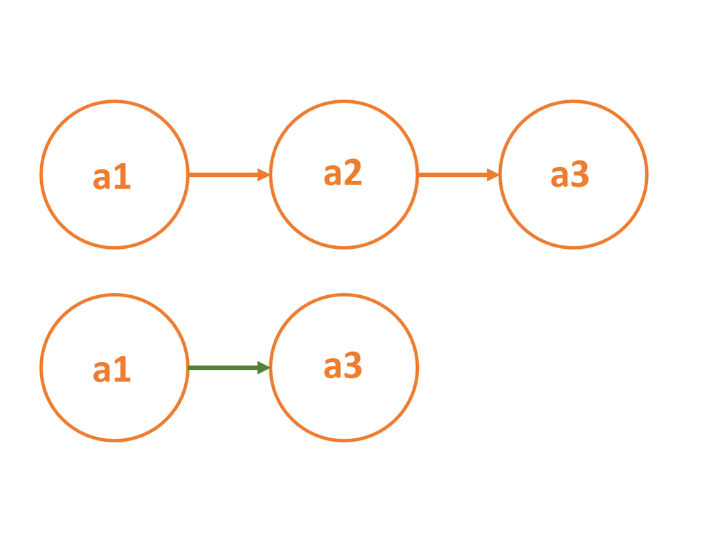

# Introduction to Data Structures - Part I

Authors: **Kaan Keskin, Fatih Semiz**

Date: July 2021

Available at (Source): https://github.com/fsemiz/Introduction-To-Data-Structures

Available at (Forked): https://github.com/kaan-keskin/Introduction-To-Data-Structures

Java Collections Framework Benchmark Tool: https://github.com/kaan-keskin/java-collections-benchmark

**Resources:**

- Introduction to Algorithms - Cormen, Leiserson, Rivest, Stein
- Algorithms - Sanjoy Dasgupta, Christos Papadimitriou, Umesh Vazirani
- Data Structures and Algorithms with Python - Kent D. Lee, Steve Hubbard
- Grokking Algorithms - Aditya Y. Bhargava
- Wikipedia - www.wikipedia.com

## Introduction
To solve a problem in the world of computer science and normal life, we must first make a plan and determine the solution steps. This can be likened to looking at a recipe before cooking. To make a computer perform a task, we need to provide more details. Technically speaking an algorithm can be defined as the following: "Finite sequence of instructions to perform a specific task in a finite amount of time". The basis of creating a good algorithm for many problems lies in storing the data to be used appropriately and efficiently. By saying efficient we generally talk about **accessing**, **insertion**, **deletion**, **searching**, and **sorting** the data. These operations complexities are directly related to which container is used to store that data.

|  |
|:--:|
| *Retrieved from https://www.techidence.com/whats-an-algorithm-understand-how-it-works-in-apps-and-websites/* |

To put it briefly, data structures are containers used to store data. However, each data structure is generally built to store a certain type of data. A data structure may be efficient in some operations but inefficient in other operations, and this is often the case. For this reason, we must choose data structures in accordance with the data at hand. For example, if you try to drink a soup with a fork, it will take you quite a while to finish it. However, if you use a spoon for soup and a fork for pasta, you will see that you can eat both fast this time. The purpose of this session will be to go over the topics of data structures as well as to remind you where and what type of data structures are used in which situation.

|  |
| :--: |
| *Retrieved from https://www.linkedin.com/pulse/eating-soup-forks-michael-henderson/* |

## Brief Overview for Java Collection Framework

The term "collection" refers to a set of items which are mostly of the same data type, and used for a specific purpose. There are a lot of collections and although they often look similar from the outside, internally, they work in very different ways. Java provides a large amount of pre-made collections.

The Collection in Java is a framework that provides an architecture to store and manipulate the group of objects.

Java Collections can achieve all the operations that you perform on a data such as searching, sorting, insertion, manipulation, and deletion.

Java Collection means a single unit of objects. Java Collection framework provides many interfaces (Set, List, Queue, Deque) and classes (ArrayList, Vector, LinkedList, PriorityQueue, HashSet, LinkedHashSet, TreeSet).

|  |
|:--:|
| *Retrieved from https://javabydeveloper.com/collection-framework-key-interfaces/* |

For more information you can read official documentation: 

https://docs.oracle.com/en/java/javase/11/docs/api/java.base/java/util/Collections.html

Throughout this document we will use below Java Collections Framework data structures as an example:

- ArrayList : In the Dynamic Array section.
- LinkedList : In the Linked List section.
- HashTable : In the Hash Table section.

Other data structures in this document will be implemented using Arrays or Linked Lists for educational purposes.

You can also check Java Collections Framework Benchmark Tool for performance comparison between these data structures: 

https://github.com/kaan-keskin/java-collections-benchmark

## Brief Overview for Python Collections Module

The collection Module in Python provides different types of containers. A Container is an object that is used to store different objects and provide a way to access the contained objects and iterate over them. Some of the built-in containers are Tuple, List, Dictionary, etc.

**Content of Collections Module:**

- Counters
- OrderedDict
- DefaultDict
- ChainMap
- NamedTuple
- DeQue
- UserDict
- UserList
- UserString

For more information you can read official documentation: 

https://docs.python.org/3/library/collections.html

## Basic Data Structures: Arrays and Linked Lists

### Array Data Structure

    Array: Contiguous area of memory consisting of equal-size elements indexed by contiguous integers.

In computer science, an array data structure, or simply an array, is a data structure consisting of a collection of elements (values or variables), each identified by at least one array index or key. An array is stored such that the position of each element can be computed from its index tuple by a mathematical formula. The simplest type of data structure is a linear array, also called one-dimensional array. 

The key point about an array is we have constant time access to read and write, O(1) operation.

    constant_time_access = array_addr + element_size x (i - first_index)

For example, an array of 10 32-bit (4-byte) integer variables, with indices 0 through 9, may be stored as 10 words at memory addresses 2000, 2004, 2008, ..., 2036, (in hexadecimal: 0x7D0, 0x7D4, 0x7D8, ..., 0x7F4) so that the element with index i has the address 2000 + (i × 4).

|  |
|:--:|
| *Retrieved from https://beginnersbook.com/2018/10/data-structure-array/* |

The memory address of the first element of an array is called first address, foundation address, or base address.

**Arrays are among the oldest and most important data structures, and are used by almost every program. They are also used to implement many other data structures, such as lists and strings.** 

They effectively exploit the addressing logic of computers. In most modern computers and many external storage devices, the memory is a one-dimensional array of words, whose indices are their addresses. Processors, especially vector processors, are often optimized for array operations.

**Arrays are useful mostly because the element indices can be computed at run time. Among other things, this feature allows a single iterative statement to process arbitrarily many elements of an array.** 

**For that reason, the elements of an array data structure are required to have the same size and should use the same data representation.** 

The set of valid index tuples and the addresses of the elements (and hence the element addressing formula) are usually, but not always, fixed while the array is in use.

**The term array is often used to mean array data type, a kind of data type provided by most high-level programming languages that consists of a collection of values or variables that can be selected by one or more indices computed at run-time. Array types are often implemented by array structures; however, in some languages they may be implemented by hash tables, linked lists, search trees, or other data structures.**

#### Running Times for Common Operations in Arrays

| Location | Add (Create) | Remove (Delete) | Read | Write (Update) |
| :--: | :--: | :--: | :--: | :--: |
| Beginning | O(n) | O(n) | O(1) | O(1) |
| End | O(1) | O(1) | O(1) | O(1) |
| Middle | O(n) | O(n) | O(1) | O(1) |

**AddEnd(value)**: We just add it, then update the number of elements that are in use. That's an O(1) operation.

**RemoveEnd()**: As well, that's an O(1) operation. Because we just update the number of elements that are in use.

**RemoveBeginning()**: Where it's get to be expensive, if we want to remove the first element. So we remove the first element, then we need to move all elements to the left (or down). That's an O(n) operation.

**AddBeginning(value)**: If we want to insert at the beginning, we need to move every element to the right (or up), then insert the element at the beginning.

Arrays are great if you want to add or remove element at the end. But it's expensive if you want to add or remove in the middle or at the beginning.

However, a huge advantage for arrays is that we have constant time access to elements either read or write.

#### Arrays in Java Programming Language

Java provides a data structure, the array, which stores a fixed-size sequential collection of elements of the same type. 

An array is used to store a collection of data, but it is often more useful to think of an array as a collection of variables of the same type.

##### Declaring Array Variables

To use an array in a program, you must declare a variable to reference the array, and you must specify the type of array the variable can reference.

**Syntax:**

```Java
dataType[] arrayRefVar;   // preferred way.

dataType arrayRefVar[];  // works but not preferred way.
```

**The following code snippets are examples of this syntax:**

```Java
double[] myList;   // preferred way.

double myList[];   // works but not preferred way.
```

##### Creating Arrays

You can create an array by using the new operator with the following syntax:

```Java
arrayRefVar = new dataType[arraySize];
```

The above statement does two things:

- It creates an array using new dataType[arraySize].
  
- It assigns the reference of the newly created array to the variable arrayRefVar.

Declaring an array variable, creating an array, and assigning the reference of the array to the variable can be combined in one statement, as shown below:

```Java
dataType[] arrayRefVar = new dataType[arraySize];
```

##### Example

Following statement declares an array variable, myList, creates an array of 10 elements of double type and assigns its reference to myList:

```Java
double[] myList = new double[10];
```

Following picture represents array myList. Here, myList holds ten double values and the indices are from 0 to 9.

|  |
|:--:|
| *Retrieved from https://www.tutorialspoint.com/java/java_arrays.htm* |

#### Arrays in Python Programming Language

An array is a vector containing homogeneous elements i.e. belonging to the same data type. Elements are allocated with contiguous memory locations allowing easy modification, that is, addition, deletion, accessing of elements. 

In Python, we have to use the array module to declare arrays. If the elements of an array belong to different data types, an exception “Incompatible data types” is thrown.

Python’s array module provides space-efficient storage of basic C-style data types like bytes, 32-bit integers, floating point numbers, and so on.

Arrays created with the **array.array class** are **mutable** and behave similarly to lists, except for one important difference — they are “**typed arrays**” constrained to a single data type.

Because of this constraint, array.array objects with many elements are more space-efficient than lists and tuples. The elements stored in them are tightly packed, and this can be useful if we need to store many elements of the same type.

Also, arrays support many of the same methods as regular lists, and we might be able to use them as a “drop-in replacement” without requiring other changes to our application code.

```Python
>>> import array
>>> arr = array.array('i', (22, 30, 10, 6))
>>> arr[1]
30 # Arrays are mutable
>>> arr[1] = 25
>>> arr
array('i', [22, 25, 10, 6])
>>> arr.append(27)
>>> arr
array('i', [22, 25, 10, 6, 27]) # Arrays are typed
>>> arr[1] = "Sarah"
TypeError: an integer is required (got type str)
```

#### NumPy (Numerical Python) Arrays in Python Programming Language

The NumPy (Numerical Python) library first appeared in 2006 and is the preferred Python array implementation. 

**It offers a high-performance, richly functional n-dimensional array type called ndarray**, which from this point forward we’ll refer to by its synonym, array.

**Operations on arrays are up to two orders of magnitude faster than those on lists.**

In a big-data world in which applications may do massive amounts of processing on vast amounts of array-based data, this performance advantage can be critical.

A strength of NumPy is “array-oriented programming,” which uses functional-style programming with internal iteration to make array manipulations concise and straightforward, eliminating the kinds of bugs that can occur with the external iteration of explicitly programmed loops.

The NumPy documentation recommends importing the numpy module as np so that you can access its members with "**np.**":

```Python
>>> import numpy as np

>>> numbers = np.array([2, 3, 5, 7, 11])
>>> numbers = np.array([x for x in range(2, 21, 2)])
>>> numbers = np.array([[2, 4, 6, 8, 10], [1, 3, 5, 7, 9]])
```

A data type object (an instance of numpy.dtype class) describes how the bytes in the fixed-size block of memory corresponding to an array item should be interpreted. It describes the following aspects of the data:

1) Type of the data (integer, float, Python object, etc.)

- **bool_**: Boolean (True or False) stored as a byte.

- **int_**: Default integer type (same as C long; normally either int64 or int32).

- **intc**: Identical to C int (normally int32 or int64).

- **intp**: Integer used for indexing (same as C ssize_t; normally either int32 or int64).

- **int8**: Byte (-128 to 127).

- **int16**: Integer (-32768 to 32767).

- **int32**: Integer (-2147483648 to 2147483647).

- **int64**: Integer (-9223372036854775808 to 9223372036854775807).

- **uint8**: Unsigned integer (0 to 255).

- **uint16**: Unsigned integer (0 to 65535).

- **uint32**: Unsigned integer (0 to 4294967295).

- **uint64**: Unsigned integer (0 to 18446744073709551615).

- **float_**: Shorthand for float64.

- **float16**: Half precision float: sign bit, 5 bits exponent, 10 bits mantissa.

- **float32**: Single precision float: sign bit, 8 bits exponent, 23 bits mantissa.

- **float64**: Double precision float: sign bit, 11 bits exponent, 52 bits mantissa.

- **complex_**: Shorthand for complex128.

- **complex64**: Complex number, represented by two 32-bit floats (real and imaginary components).

- **complex128**: Complex number, represented by two 64-bit floats (real and imaginary components).

2) Size of the data (how many bytes is in e.g. the integer)

3) Byte order of the data (little-endian or big-endian)

4) If the data type is structured data type, an aggregate of other data types, (e.g., describing an array item consisting of an integer and a float),

    - what are the names of the “fields” of the structure, by which they can be accessed,
    
    - what is the data-type of each field, and
    
    - which part of the memory block each field takes.

5) If the data type is a sub-array, what is its shape and data type.

```Python
# Python program to demonstrate 
# the use of data type object with structured array.
import numpy as np
  
dt = np.dtype([('name', np.unicode_, 16), ('grades', np.float64, (2,))])
  
# x is a structured array with names and marks of students.
# Data type of name of the student is np.unicode_ and 
# data type of marks is np.float(64)
x = np.array([('Sarah', (8.0, 7.0)), ('John', (6.0, 7.0))], dtype=dt)
  
print(x[1])
print("Grades of John are: ",x[1]['grades'])
print("Names are: ",x['name'])
```

For more detailed information: https://numpy.org/doc/stable/reference/arrays.dtypes.html

### Dynamic Array Data Structure

In computer science, **a dynamic array, growable array, resizable array, dynamic table, mutable array, or array list** is a random access, variable-size list data structure that allows elements to be added or removed. It is supplied with standard libraries in many modern mainstream programming languages. Dynamic arrays overcome a limit of static arrays, which have a fixed capacity that needs to be specified at allocation.

A Dynamic array (vector in C++, ArrayList in Java) automatically grows when we try to make an insertion and there is no more space left for the new item. Usually the area doubles in size.

**A simple dynamic array can be constructed by allocating an array of fixed-size, typically larger than the number of elements immediately required.** The elements of the dynamic array are stored contiguously at the start of the underlying array, and the remaining positions towards the end of the underlying array are reserved, or unused. Elements can be added at the end of a dynamic array in constant time by using the reserved space until this space is completely consumed.

**When all space is consumed, and an additional element is to be added, the underlying fixed-sized array needs to be increased in size. Typically resizing is expensive because you have to allocate a bigger array and copy over all of the elements from the array you have overgrow before we can finally append our item.**

|  |
|:--:|
| *Retrieved from https://en.wikipedia.org/wiki/Dynamic_array* |

Approach: When we enter an element in array but array is full then you create a function, this function creates a new array double size or as you wish and copy all element from the previous array to a new array and return this new array. Also, we can reduce the size of the array, and add an element at a given position, remove the element at the end default and at the position also.

#### Running Times for Common Operations in Dynamic Arrays

| Location | Add (Create) | Remove (Delete) | Read | Write (Update) |
| :--: | :--: | :--: | :--: | :--: |
| Beginning | O(n) | O(n) | O(1) | O(1) |
| End | **O(1) Amortized** | **O(1) Amortized** | O(1) | O(1) |
| Middle | O(n) | O(n) | O(1) | O(1) |

#### Amortized Analysis

In computer science, amortized analysis is a method for analyzing a given algorithm's complexity, or how much of a resource, especially time or memory, it takes to execute. 

**The motivation for amortized analysis is that looking at the worst-case run time per operation, rather than per algorithm, can be too pessimistic.**

**While certain operations for a given algorithm may have a significant cost in resources, other operations may not be as costly. The amortized analysis considers both the costly and less costly operations together over the whole series of operations of the algorithm. This may include accounting for different types of input, length of the input, and other factors that affect its performance.**

Amortized analysis requires knowledge of which series of operations are possible. This is most commonly the case with data structures, which have state that persists between operations. 

**The basic idea is that a worst-case operation can alter the state in such a way that the worst case cannot occur again for a long time, thus "amortizing" its cost.**

There are generally three methods for performing amortized analysis: the aggregate method, the accounting method, and the potential method. All of these give correct answers; the choice of which to use depends on which is most convenient for a particular situation.

- **Aggregate Method**: Aggregate analysis determines the upper bound T(n) on the total cost of a sequence of n operations, then calculates the amortized cost to be T(n) / n.
    
- **Banker's Method**: The accounting method is a form of aggregate analysis which assigns to each operation an amortized cost which may differ from its actual cost. Early operations have an amortized cost higher than their actual cost, which accumulates a saved "credit" that pays for later operations having an amortized cost lower than their actual cost. Because the credit begins at zero, the actual cost of a sequence of operations equals the amortized cost minus the accumulated credit. Because the credit is required to be non-negative, the amortized cost is an upper bound on the actual cost. Usually, many short-running operations accumulate such credit in small increments, while rare long-running operations decrease it drastically.
    
- **Physicist's Method**: The potential method is a form of the accounting method where the saved credit is computed as a function (the "potential") of the state of the data structure. The amortized cost is the immediate cost plus the change in potential.

#### Dynamic Array in Java Programming Language

```Java
// Java program deals with all operation of a dynamic array
// add, remove, resize memory of array is the main feature
public class DynamicArray {
  
    // create three variable array[] is a array,
    // count will deal with no of element add by you and
    // size will with size of array[]
    private int array[];
    private int count;
    private int size;
    // constructor initialize value to variable
  
    public DynamicArray()
    {
        array = new int[1];
        count = 0;
        size = 1;
    }
    // function add an element at the end of array
  
    public void add(int data)
    {
  
        // check no of element is equql to size of array
        if (count == size) {
            growSize(); // make array size double
        } // insert element at end of array
        array[count] = data;
        count++;
    }
  
    // function makes size double of array
    public void growSize()
    {
  
        int temp[] = null;
        if (count == size) {
  
            // temp is a double size array of array
            // and store array elements
            temp = new int[size * 2];
            {
                for (int i = 0; i < size; i++) {
                    // copy all array value into temp
                    temp[i] = array[i];
                }
            }
        }
  
        // double size array temp initialize
        // into variable array again
        array = temp;
         
        // and make size is double also of array
        size = size * 2;
    }
  
    // function shrink size of array
    // which block unnecessary remove them
    public void shrinkSize()
    {
        int temp[] = null;
        if (count > 0) {
  
            // temp is a count size array
            // and store array elements
            temp = new int[count];
            for (int i = 0; i < count; i++) {
  
                // copy all array value into temp
                temp[i] = array[i];
            }
  
            size = count;
  
            // count size array temp initialize 
            // into variable array again
            array = temp;
        }
    }
    // function add an element at given index
  
    public void addAt(int index, int data)
    {
        // if size is not enough make size double
        if (count == size) {
            growSize();
        }
  
        for (int i = count - 1; i >= index; i--) {
  
            // shift all element right 
            // from given index
            array[i + 1] = array[i];
        }
  
        // insert data at given index
        array[index] = data;
        count++;
    }
  
    // function remove last element or put
    // zero at last index
    public void remove()
    {
        if (count > 0) {
            array[count - 1] = 0;
            count--;
        }
    }
  
    // function shift all element of right
    // side from given index in left
    public void removeAt(int index)
    {
        if (count > 0) {
            for (int i = index; i < count - 1; i++) {
  
                // shift all element of right 
                // side from given index in left
                array[i] = array[i + 1];
            }
            array[count - 1] = 0;
            count--;
        }
    }
}
```

#### Lists in Python Programming Language

A list in Python is a collection of items which can contain elements of multiple data types, which may be either numeric, character logical values, etc. It is an ordered collection supporting negative indexing. A list can be created using [] containing data values. 

Contents of lists can be easily merged and copied using python’s inbuilt functions.

```Python
# creating a list containing elements 
# belonging to different data types
>>> sample_list = [1,"Yash",['a','e']]
>>> print(sample_list)
[1, 'Yash', ['a', 'e']]
```

| Operation | Complexity | Usage | Method |
| :--: | :--: | :--: | :--: |
| List creation | O(n) or O(1) | x = list(y) | calls \_\_init\_\_(y) |
| indexed get | O(1) | a = x[i] | x.\_\_getitem\_\_(i) |
| indexed set | O(1) | x[i] = a | x.\_\_setitem\_\_(i,a) |
| concatenate | O(n) | z=x+y  | z = x.\_\_add\_\_(y) |
| append | O(1) | x.append(a) | x.append(a) |
| insert | O(n) | x.insert(i,e) | x.insert(i,e) |
| delete | O(n) | del x[i] | x.\_\_delitem\_\_(i) |
| equality | O(n) | x == y | x.\_\_eq\_\_(y) |
| iterate | O(n) | for a in x: | x.\_\_iter\_\_() |
| length | O(1) | len(x) | x.\_\_len\_\_() |
| membership | O(n) | a in x | x.\_\_contains\_\_(a) |
| sort | O(n log n) | x.sort() | x.sort() |

Each of the operations in the table has an associated complexity. 

The performance of an algorithm depends on the complexity of the operations used in implementing that algorithm. 

The indexed get and indexed set operations can be observed to have O(1) complexity. This complexity is achieved because the memory of a computer is randomly accessible, which is why it is called Random Access Memory.

**Additional Information:**

Python's List is a dynamic array. This is implementation dependent for each Python Interpreter:

- CPython uses an array of pointers
- Jython uses an ArrayList
- IronPython also uses an array. 

You can browse the source code to find out. Thus they all have O(1) random access.

#### List vs. Array Performance in Python Programming Language

**Most array operations execute significantly faster than corresponding list operations.**

To demonstrate, we’ll use the **IPython %timeit** **magic command**, which times the average duration of operations. Note that the times displayed on your system may vary from what we show here.

**Timing the Creation of a List Containing Results of 6,000,000 Die Rolls:**

```Python
>>> import random

>>> %timeit rolls_list = [random.randrange(1, 7) for i in range(0, 6_000_000)]

6.29 s ± 119 ms per loop (mean ± std. dev. of 7 runs, 1 loop each)
```

By default, %timeit executes a statement in a loop, and it runs the loop seven times. If you do not indicate the number of loops, %timeit chooses an appropriate value. 

In our testing, operations that on average took more than 500 milliseconds iterated only once, and operations that took fewer than 500 milliseconds iterated 10 times or more. After executing the statement, %timeit displays the statement’s average execution time, as well as the standard deviation of all the executions. On average, %timeit indicates that it took 6.29 seconds ( s ) to create the list with a standard deviation of 119 milliseconds ( ms ). In total, the preceding snippet took about 44 seconds to run the snippet seven times.

**Timing the Creation of an array Containing Results of 6,000,000 Die Rolls:**

Now, let’s use the randint function from the numpy.random module to create an array of 6,000,000 die rolls.

```Python
>>> import numpy as np

>>> %timeit rolls_array = np.random.randint(1, 7, 6_000_000)

72.4 ms ± 635 μs per loop (mean ± std. dev. of 7 runs, 10 loops each)
```

On average, %timeit indicates that it took only 72.4 milliseconds with a standard deviation of 635 microseconds ( μs ) to create the array. 

**In total, the preceding snippet took just under half a second to execute on our computer—about 1/100th of the time snippet took to execute. The operation is two orders of magnitude faster with array!**

#### Differences Between Arrays and Lists in Python

Now that we know their definitions and features, we can talk about the differences between lists and arrays in Python:

- Arrays need to be declared. Lists don't, since they are built into Python. In the examples above, you saw that lists are created by simply enclosing a sequence of elements into square brackets. Creating an array, on the other hand, requires a specific function from either the array module (i.e., array.array()) or NumPy package (i.e., numpy.array()). Because of this, lists are used more often than arrays.

- Arrays can store data very compactly and are more efficient for storing large amounts of data.

- Arrays are great for numerical operations; lists cannot directly handle math operations. For example, you can divide each element of an array by the same number with just one line of code. If you try the same with a list, you'll get an error.

So, when should you use a list and when should you use an array?

- If you need to store a relatively short sequence of items and you don't plan to do any mathematical operations with it, a list is the preferred choice. This data structure will allow you to store an ordered, mutable, and indexed sequence of items without importing any additional modules or packages.

- If you have a very long sequence of items, consider using an array. This structure offers more efficient data storage.

- If you plan to do any numerical operations with your combination of items, use an array. Data analytics and data science rely heavily on (mostly NumPy) arrays.

#### pandas Series and DataFrames in Python Programming Language

NumPy’s array is optimized for homogeneous numeric data that’s accessed via integer indices. 

**Data science presents unique demands for which more customized data structures are required. Big data applications must support mixed data types, customized indexing, missing data, data that’s not structured consistently and data that needs to be manipulated into forms appropriate for the databases and data analysis packages you use.**

Pandas is the most popular library for dealing with such data. It provides two key collections: Series for one-dimensional collections and DataFrame's for two-dimensional collections. You can use pandas’ MultiIndex to manipulate multi-dimensional data in the context of Series and DataFrame's.

**Wes McKinney** created pandas in **2008** while working in industry. The name **pandas** is derived from the term “**panel data**”, which is data for measurements over time, such as stock prices or historical temperature readings. McKinney needed a library in which the same data structures could handle both time- and non-time-based data with support for data alignment, missing data, common database-style data manipulations, and more.

##### pandas Series

**A Series is an enhanced one-dimensional array. Whereas arrays use only zero-based integer indices, Series support custom indexing, including even non-integer indices like strings.** 

```Python
>>> import pandas as pd

>>> grades = pd.Series([87, 100, 94])
>>> grades
0     87
1    100
2     94
dtype: int64

>>> pd.Series([87, 100, 94], index=['Wally', 'Eva', 'Sam'])
Wally     87
Eva      100
Sam       94
dtype: int64

>>> pd.Series({'Wally': 87, 'Eva': 100, 'Sam': 94})
Wally     87
Eva      100
Sam       94
dtype: int64

>>> pd.Series([1, 2, None, 'kaan'])
0       1
1       2
2    None
3    kaan
dtype: object

```

##### pandas DataFrames

DataFrame is an enhanced two-dimensional array . Like Series, DataFrames can have custom row and column indices, and offer additional operations and capabilities that make them more convenient for many data-science oriented tasks. 

DataFrames also support missing data. Each column in a DataFrame is a Series. The Series representing each column may contain different element types.

```Python
>>> import pandas as pd

>>> grades_dict = {'Wally': [87, 96, 70], 'Eva': [100, 87, 90],
    ...: 'Sam': [94, 77, 90], 'Katie': [100, 81, 82],
    ...: 'Bob': [83, 65, 85]}
>>> grades = pd.DataFrame(grades_dict)
>>> grades
   Wally  Eva  Sam  Katie  Bob
0     87  100   94    100   83
1     96   87   77     81   65
2     70   90   90     82   85
>>> grades.index = ['Test1', 'Test2', 'Test3']
>>> grades
       Wally  Eva  Sam  Katie  Bob
Test1     87  100   94    100   83
Test2     96   87   77     81   65
Test3     70   90   90     82   85
```

### Linked Lists

**In computer science, a linked list is a linear collection of data elements whose order is not given by their physical placement in memory. Instead, each element points to the next.**

**It is a data structure consisting of a collection of nodes which together represent a sequence. In its most basic form, each node contains: data, and a reference (in other words, a link) to the next node in the sequence.** 

This structure allows for efficient insertion or removal of elements from any position in the sequence during iteration. More complex variants add additional links, allowing more efficient insertion or removal of nodes at arbitrary positions. 

A drawback of linked lists is that access time is linear (and difficult to pipeline). Faster access, such as random access, is not feasible. Arrays have better cache locality compared to linked lists.

|  |
| :----------------------------------------------------------: |
| *Retrieved from https://msatechnosoft.in/blog/linked-list-implementatio-types-singly-doubly-circular-example-with-code/* |

Linked lists are among the simplest and most common data structures. **They can be used to implement several other common abstract data types, including lists, stacks, queues, associative arrays, and S-expressions, though it is not uncommon to implement those data structures directly without using a linked list as the basis.**

The principal benefit of a linked list over a conventional array is that the list elements can be easily inserted or removed without reallocation or reorganization of the entire structure because the data items need not be stored contiguously in memory or on disk, while restructuring an array at run-time is a much more expensive operation. 

Linked lists allow insertion and removal of nodes at any point in the list, and allow doing so with a constant number of operations by keeping the link previous to the link being added or removed in memory during list traversal.

On the other hand, since simple linked lists by themselves do not allow random access to the data or any form of efficient indexing, many basic operations—such as obtaining the last node of the list, finding a node that contains a given datum, or locating the place where a new node should be inserted—may require iterating through most or all of the list elements. 

Linked lists are dynamic, so the length of a linked list can increase or decrease as necessary. Each node does not necessarily follow the previous one physically in the memory.

#### Linear Data Structures

**One characteristic of linked lists is that they are linear data structures, which means that there is a sequence and an order to how they are constructed and traversed.**

We can think of a linear data structure like a game of hopscotch: in order to get to the end of the list, we have to go through all of the items in the list in order, or sequentially. 

Linear structures, however, are the opposite of non-linear structures. **In non-linear data structures, items don’t have to be arranged in order, which means that we could traverse the data structure non-sequentially.**

|  |
| :----------------------------------------------------------: |
| *Retrieved from https://medium.com/basecs/whats-a-linked-list-anyway-part-1-d8b7e6508b9d* |

#### Memory Management

The biggest differentiator between arrays and linked lists is the way that they use memory in our machines. 

When an array is created, it needs a certain amount of memory. If we had 7 letters that we needed to store in an array, we would need 7 bytes of memory to represent that array. But, we’d need all of that memory in one contiguous block. That is to say, our computer would need to locate 7 bytes of memory that was free, one byte next to the another, all together, in one place.

On the other hand, when a linked list is born, it doesn’t need 7 bytes of memory all in one place. One byte could live somewhere, while the next byte could be stored in another place in memory altogether! Linked lists don’t need to take up a single block of memory; instead, the memory that they use can be scattered throughout.

**The fundamental difference between arrays and linked lists is that arrays are static data structures, while linked lists are dynamic data structures.**

A static data structure needs all of its resources to be allocated when the structure is created; this means that even if the structure was to grow or shrink in size and elements were to be added or removed, it still always needs a given size and amount of memory. If more elements needed to be added to a static data structure and it didn’t have enough memory, you’d need to copy the data of that array, for example, and recreate it with more memory, so that you could add elements to it.

On the other hand, a dynamic data structure can shrink and grow in memory. It doesn’t need a set amount of memory to be allocated in order to exist, and its size and shape can change, and the amount of memory it needs can change as well.

|  |
|:--:|
| *Retrieved from https://medium.com/basecs/whats-a-linked-list-anyway-part-1-d8b7e6508b9d* |

#### Basic Concepts and Nomenclature

**Each record of a linked list is often called an 'element' or 'node'.**

The field of each node that contains the address of the next node is usually called the 'next link' or 'next pointer'. The remaining fields are known as the 'data', 'information', 'value', 'cargo', or 'payload' fields.

**The 'head' of a list is its first node.** 

**The 'tail' of a list may refer either to the rest of the list after the head, or to the last node in the list.** 

|  |
| :----------------------------------------------------------: |
| *Retrieved from https://www.codecademy.com/learn/linear-data-structures-java/modules/singly-linked-lists-java/cheatsheet* |

#### Linked List API

The operations provided from the Linked List are given the table below:

| Method Name | Explanation |
| :--: | :--: |
| PushFront(key) | add to front |
| TopFront() | return front item |
| PopFront() | remove front item |
| PushBack(key) | add to back |
| TopBack() | return back item |
| PopBack() | remove back item |
| Find(key) | is key in list? |
| Erase(key) | remove key from list |
| Empty() | empty list? |
| AddBefore(node,key) | adds key before node |
| AddAfter(node,key) | adds key after node |

#### Removing a node from the middle of a linked list

When removing a node from the middle of a linked list, it is necessary to adjust the link on the previous node so that it points to the following node. In the given illustration, the node a1 must point to the node a3 if the node a2 is removed from the linked list.

|  |
| :----------------------------------------------------------: |
| *Retrieved from https://www.codecademy.com/learn/linear-data-structures-java/modules/singly-linked-lists-java/cheatsheet* |

#### Adding a new head node in a linked list

When adding a new node to the start of a linked list, it is necessary to maintain the list by giving the new head node a link to the current head node. For instance, to add a new node a0 to the begining of the linked list, a0 should point to a1.

|  |
| :----------------------------------------------------------: |
| *Retrieved from https://www.codecademy.com/learn/linear-data-structures-java/modules/singly-linked-lists-java/cheatsheet* |

#### Singly-Linked List

Singly linked lists contain nodes which have a data field as well as 'next' field, which points to the next node in line of nodes. 

Singly-Linked List Node Contains:
- key
- next pointer

|  |
|:--:|
| *Retrieved from https://msatechnosoft.in/blog/linked-list-implementatio-types-singly-doubly-circular-example-with-code/* |

#### Running Times for Common Operations in Singly-Linked List

| Singly-Linked List API | No Tail Pointer | With Tail Pointer |
| :--: | :--: | :--: |
| PushFront(key) | O(1) | O(1) |
| TopFront() | O(1) | O(1) |
| PopFront() | O(1) | O(1) |
| PushBack(key) | **O(n)** | **O(1)** |
| TopBack() | **O(n)** | **O(1)** |
| PopBack() | O(n) | O(n) |
| Find(key) | O(n) | O(n) |
| Erase(key) | O(n) | O(n) |
| Empty() | O(1) | O(1) |
| AddBefore(node,key) | O(n) | O(n) |
| AddAfter(node,key) | O(n) | O(n) |

#### Doubly-Linked List

In a doubly linked list, each node contains, besides the next-node link, a second link field pointing to the **previous** node in the sequence. The two links may be called **forward('s')** and **backwards**, or **next** and **prev** (**previous**). 

Doubly-Linked List Node Contains:
- key
- next pointer
- previous pointer

|  |
|:--:|
| *Retrieved from https://msatechnosoft.in/blog/linked-list-implementatio-types-singly-doubly-circular-example-with-code/* |

#### Running Times for Common Operations in Doubly-Linked List

| Doubly-Linked List API | No Tail Pointer | With Tail Pointer |
| :--: | :--: | :--: |
| PushFront(key) | O(1) | O(1) |
| TopFront() | O(1) | O(1) |
| PopFront() | O(1) | O(1) |
| PushBack(key) | **O(n)** | **O(1)** |
| TopBack() | **O(n)** | **O(1)** |
| PopBack() | **O(1)** | **O(1)** |
| Find(key) | O(n) | O(n) |
| Erase(key) | O(n) | O(n) |
| Empty() | O(1) | O(1) |
| AddBefore(node,key) | **O(1)** | **O(1)** |
| AddAfter(node,key) | **O(1)** | **O(1)** |

#### Implementing a Singly-Linked List in Java Programming Language

Like arrays, Linked List is a linear data structure. Unlike arrays, linked list elements are not stored at the contiguous location, the elements are linked using pointers.

In Java, LinkedList can be represented as a class and a Node as a separate class. The LinkedList class contains a reference of Node class type.

```Java
import java.io.*;
 
// Java program to implement a Singly Linked List without a tail pointer
public class LinkedList {
 
    Node head; // head of list
 
    // Linked list Node.
    // Node is a static nested class so main() can access it
    static class Node {
 
        int data; // Type of the data stored in the node
        Node next;
 
        // Constructor
        Node(int d)
        {
            data = d;
            next = null;
        }
    }
 
    // **************INSERTION**************
 
    // Method to insert a new node
    public static LinkedList insert(LinkedList list, int data)
    {
        // Create a new node with given data
        Node new_node = new Node(data);
        new_node.next = null;
 
        // If the Linked List is empty,
        // then make the new node as head
        if (list.head == null) {
            list.head = new_node;
        } else {
            // Else traverse till the last node
            // and insert the new_node there
            Node last = list.head;
            while (last.next != null) {
                last = last.next;
            }
 
            // Insert the new_node at last node
            last.next = new_node;
        }
 
        // Return the list by head
        return list;
    }
 
    // **************TRAVERSAL**************
 
    // Method to print the LinkedList.
    public static void printList(LinkedList list)
    {
        Node currNode = list.head;
 
        System.out.print("\nLinkedList: ");
 
        // Traverse through the LinkedList
        while (currNode != null) {
            // Print the data at current node
            System.out.print(currNode.data + " ");
 
            // Go to next node
            currNode = currNode.next;
        }
        System.out.println("\n");
    }
 
    // **************DELETION BY KEY**************
 
    // Method to delete a node in the LinkedList by KEY
    public static LinkedList deleteByKey(LinkedList list,
                                         int key)
    {
        // Store head node
        Node currNode = list.head, prev = null;
 
        //
        // CASE 1:
        // If head node itself holds the key to be deleted
 
        if (currNode != null && currNode.data == key) {
            list.head = currNode.next; // Changed head
 
            // Display the message
            System.out.println(key + " found and deleted");
 
            // Return the updated List
            return list;
        }
 
        //
        // CASE 2:
        // If the key is somewhere other than at head
        //
 
        // Search for the key to be deleted,
        // keep track of the previous node
        // as it is needed to change currNode.next
        while (currNode != null && currNode.data != key) {
            // If currNode does not hold key
            // continue to next node
            prev = currNode;
            currNode = currNode.next;
        }
 
        // If the key was present, it should be at currNode
        // Therefore the currNode shall not be null
        if (currNode != null) {
            // Since the key is at currNode
            // Unlink currNode from linked list
            prev.next = currNode.next;
 
            // Display the message
            System.out.println(key + " found and deleted");
        }
 
        //
        // CASE 3: The key is not present
        //
 
        // If key was not present in linked list
        // currNode should be null
        if (currNode == null) {
            // Display the message
            System.out.println(key + " not found");
        }
 
        // return the List
        return list;
    }
 
    // **************DELETION AT A POSITION**************
 
    // Method to delete a node in the LinkedList by POSITION
    public static LinkedList
    deleteAtPosition(LinkedList list, int index)
    {
        // Store head node
        Node currNode = list.head, prev = null;
 
        //
        // CASE 1:
        // If index is 0, then head node itself is to be
        // deleted
 
        if (index == 0 && currNode != null) {
            list.head = currNode.next; // Changed head
 
            // Display the message
            System.out.println(
                index + " position element deleted");
 
            // Return the updated List
            return list;
        }
 
        //
        // CASE 2:
        // If the index is greater than 0 but less than the
        // size of LinkedList
        //
        // The counter
        int counter = 0;
 
        // Count for the index to be deleted,
        // keep track of the previous node
        // as it is needed to change currNode.next
        while (currNode != null) {
 
            if (counter == index) {
                // Since the currNode is the required
                // position Unlink currNode from linked list
                prev.next = currNode.next;
 
                // Display the message
                System.out.println(
                    index + " position element deleted");
                break;
            }
            else {
                // If current position is not the index
                // continue to next node
                prev = currNode;
                currNode = currNode.next;
                counter++;
            }
        }
 
        // If the position element was found, it should be
        // at currNode Therefore the currNode shall not be
        // null
        //
        // CASE 3: The index is greater than the size of the
        // LinkedList
        //
        // In this case, the currNode should be null
        if (currNode == null) {
            // Display the message
            System.out.println(
                index + " position element not found");
        }
 
        // return the List
        return list;
    }
}
```

Usage of implemented LinkedList class:

```Java
    // **************MAIN METHOD**************
 
    // method to create a Singly-Linked List with n nodes
    public static void main(String[] args)
    {
        /* Start with the empty list. */
        LinkedList list = new LinkedList();
 
        //
        // ******INSERTION******
        //
 
        // Insert the values
        list = insert(list, 1);
        list = insert(list, 2);
        list = insert(list, 3);
        list = insert(list, 4);
        list = insert(list, 5);
        list = insert(list, 6);
        list = insert(list, 7);
        list = insert(list, 8);
 
        // Print the LinkedList
        printList(list);
 
        //
        // ******DELETION BY KEY******
        //
 
        // Delete node with value 1
        // In this case the key is ***at head***
        deleteByKey(list, 1);
 
        // Print the LinkedList
        printList(list);
 
        // Delete node with value 4
        // In this case the key is present ***in the
        // middle***
        deleteByKey(list, 4);
 
        // Print the LinkedList
        printList(list);
 
        // Delete node with value 10
        // In this case the key is ***not present***
        deleteByKey(list, 10);
 
        // Print the LinkedList
        printList(list);
 
        //
        // ******DELETION AT POSITION******
        //
 
        // Delete node at position 0
        // In this case the key is ***at head***
        deleteAtPosition(list, 0);
 
        // Print the LinkedList
        printList(list);
 
        // Delete node at position 2
        // In this case the key is present ***in the
        // middle***
        deleteAtPosition(list, 2);
 
        // Print the LinkedList
        printList(list);
 
        // Delete node at position 10
        // In this case the key is ***not present***
        deleteAtPosition(list, 10);
 
        // Print the LinkedList
        printList(list);
    }
```

#### Implementing a Singly-Linked List in Python Programming Language

Sequences can be organized in several different ways. 

The PyList sequence was a randomly accessible list. This means that we can access any element of the list in O(1) time to either store or retrieve a value. Appending an item was possible in O(1) time using amortized complexity analysis, but inserting an item took O(n) time where n was the number of items after the location where the new item was being inserted.

If a programmer wants to insert a large number of items towards the beginning of a list, a different organization for a sequence might be better suited to their needs.

A linked list is an organization of a list where each item in the list is in a separate node. Linked lists look like the links in a chain. Each link is attached to the next link by a reference that points to the next link in the chain. When working with a linked list, each link in the chain is called a Node. Each node consists of two pieces of information, an item, which is the data associated with the node, and a link to the next node in the linked list, often called next.

```Python
class Node:

    def __init__(self, item, next=None):
        self.item = item
        self.next = next

    def getItem(self):
        return self.item

    def getNext(self):
        return self.next

    def setItem(self, item):
        self.item = item

    def setNext(self, next):
        self.next = next
```

In the Node class there are two pieces of information: the item is a reference to a value in the list, and the next reference which points to the next node in the sequence.

```Python
class LinkedList:
  
    class __Node:
        # This class is used internally by the LinkedList class. It is
        # invisible from outside this class due to the two underscores
        # that precede the class name. Python mangles names so that they
        # are not recognizable outside the class when two underscores
        # precede a name but aren’t followed by two underscores at the
        # end of the name (i.e. an operator name).

        def __init__(self, item, next=None):
            self.item = item
            self.next = next

        def getItem(self):
            return self.item

        def getNext(self):
            return self.next

        def setItem(self, item):
            self.item = item

        def setNext(self, next):
            self.next = next

    def __init__(self, contents=[]):
        # Here we keep a reference to the first node in the linked list
        # and the last item in the linked list. They both point to a
        # dummy node to begin with. This dummy node will always be in
        # the first position in the list and will never contain an item.
        # Its purpose is to eliminate special cases in the code below.

        self.first = LinkedList.__Node(None, None)  # Head Pointer
        self.last = self.first  # Tail Pointer
        self.numItems = 0

        for e in contents:
            self.append(e)

    def __getitem__(self, index):
        if index >= 0 and index < self.numItems:
            cursor = self.first.getNext()
            for i in range(index):
                cursor = cursor.getNext()
            
            return cursor.getItem()

        raise IndexError("LinkedList index out of range")

    def __setitem__(self, index, val):
        if index >= 0 and index < self.numItems:
            cursor = self.first.getNext()
            for i in range(index):
                cursor = cursor.getNext()

            cursor.setItem(val)
            return

        raise IndexError("LinkedList assignment index out of range")

    def __add__(self,other):
        if type(self) != type(other):
            raise TypeError("Concatenate undefined for " + \
                str(type(self)) + " + " + str(type(other)))

        result = LinkedList()
        cursor = self.first.getNext()

        while cursor != None:
            result.append(cursor.getItem())
            cursor = cursor.getNext()

        cursor = other.first.getNext()

        while cursor != None:
            result.append(cursor.getItem())
            cursor = cursor.getNext()

        return result

    def append(self,item):
        node = LinkedList.__Node(item)
        self.last.setNext(node)
        self.last = node
        self.numItems += 1

    def insert(self,index,item):
        cursor = self.first

        if index < self.numItems:
            for i in range(index):
                cursor = cursor.getNext()

            node = LinkedList.__Node(item, cursor.getNext())
            cursor.setNext(node)
            self.numItems += 1
        else:
            self.append(item)
```

You can find detailed implementation here: 

https://www.devmaking.com/learn/data-structures/doubly-linked-list/

##### Running Times for Implemented Singly-Linked List in Python Programming Language

| Operation | Complexity | Usage | Method |
| :--: | :--: | :--: | :--: |
| List creation | O(len(y)) | x = LinkedList(y) | calls \_\_init\_\_(y) |
| indexed get | O(n) | a = x[i] | x.\_\_getitem\_\_(i) |
| indexed set | O(n) | x[i] = a | x.\_\_setitem\_\_(i,a) |
| concatenate | O(n) | z=x+y | z = x.\_\_add\_\_(y) |
| append | O(1) | x.append(a) | x.append(a) |
| insert | O(n) | x.insert(i,e) | x.insert(i,e)) |
| delete | O(n) | del x[i] | x.\_\_delitem\_\_(i) |
| equality | O(n) | x == y | x.\_\_eq\_\_(y) |
| iterate | O(n) | for a in x: | x.\_\_iter\_\_() |
| length | O(1) | len(x) | x.\_\_len\_\_() |
| membership | O(n) | a in x | x.\_\_contains\_\_(a) |
| sort | N/A | N/A | N/A |

## Elementary Data Structures

### Stacks

**A stack is a data structure where access is only at one end of the sequence. New values are pushed onto the stack to add them to the sequence and popped off the stack to remove them from the sequence.**

**Stacks are called Last In/First Out or LIFO data structures. The last item pushed is the first item popped. A Stack class can be implemented in at least a couple different ways to achieve the computation complexities outlined in this table. Either a list or a linked list will suffice.**

#### Running Time Complexity of Stack Operations

| Operation | Complexity | Usage | Description |
| :--: | :--: | :--: | :--: |
| Stack Creation | O(1) | s=Stack() | calls the constructor |
| pop | O(1) | a=s.pop() | returns the last item pushed and removes it from s |
| push | O(1) | s.push(a) | pushes the item, a, on the stack, s |
| top | O(1) | a=s.top() | returns the top item without popping s |
| isEmpty | O(1) | s.isEmpty() | returns True if s has no pushed items |

#### Implementing a Stack in Python Programming Language

**The code below is an implementation of a stack with a list. The implementation is pretty straight-forward.**

```Python
class Stack:

    def __init__(self):
        self.items = []

    def pop(self):
        if self.isEmpty():
            raise RuntimeError("Attempt to pop an empty stack")

        topIdx = len(self.items)-1
        item = self.items[topIdx]
        del self.items[topIdx]

        return item

    def push(self,item):
        self.items.append(item)

    def top(self):
        if self.isEmpty():
            raise RuntimeError("Attempt to get top of empty stack")

        topIdx = len(self.items)-1

        return self.items[topIdx]
    
    def isEmpty(self):
        return len(self.items) == 0

```

The main program implemented below tests the stack datatype with a couple tests to make sure the code operates correctly.

```Python
def main():

    s = Stack()
    lst = list(range(10))
    lst2 = []

    for k in lst:
        s.push(k)

    if s.top() == 9:
        print("Test 1 Passed")
    else:
        print("Test 1 Failed")

    while not s.isEmpty():
        lst2.append(s.pop())

    lst2.reverse()

    if lst2 != lst:
        print("Test 2 Failed")
    else:
        print("Test 2 Passed")
    
    try:
        s.pop()
        print("Test 3 Failed")
    except RuntimeError:
        print("Test 3 Passed")
    except:
        print("Test 3 Failed")

    try:
        s.top()
        print("Test 4 Failed")
    except RuntimeError:
        print("Test 4 Passed")
    except:
        print("Test 4 Failed")
    
```

### Queues

**In a queue, the element deleted is always the one that has been in the set for the longest time: the queue implements a first-in, first-out, or FIFO, policy.**

**A queue is like a stack in many ways except that instead of being a LIFO data structure, queues are FIFO or First In/First Out data structures. The first item pushed, is the first item popped. When we are working with a queue we talk of enqueueing an item, instead of pushing it. When removing an item from the queue we talk of dequeueing the item instead of popping it as we did from a stack.*

#### Running Time Complexity of Queue Operations

| Operation | Complexity | Usage | Description |
| :--: | :--: | :--: | :--: |
| Queue Creation | O(1) | q=Queue() | calls the constructor |
| dequeue | O(1) | a=q.dequeue() | returns the first item enqueued and removes it from q |
| enqueue | O(1) | q.enqueue(a) | enqueues the item, a, on the queue, q |
| front | O(1) | a=q.front() | returns the front item without dequeueing the item |
| isEmpty | O(1) | q.isEmpty() | returns True if q has not enqueued items |

#### Implementing a Queue in Python Programming Language

Implementing a queue with the complexities given in this table is a bit trickier than implementing the stack. To implement a queue with these complexities we need to be able to add to one end of a sequence and remove from the other end of the sequence in O(1) time. This suggests the use of a linked list. 

Certainly, a linked list would work to get the desired complexities. However, we can still use a list if we are willing to accept an amortized complexity of O(1) for the dequeue operation.

This Queue class code implements a queue with a list and achieves an amortized complexity of O(1) for the dequeue operation.

```Python
class Queue:
    def __init__(self):
        self.items = []
        self.frontIdx = 0
    
    def __compress(self):
        newlst = []

        for i in range(self.frontIdx,len(self.items)):
            newlst.append(self.items[i])

        self.items = newlst
        self.frontIdx = 0

    def dequeue(self):
        if self.isEmpty():
            raise RuntimeError("Attempt to dequeue an empty queue")

        # When queue is half full, compress it. This
        # achieves an amortized complexity of O(1) while
        # not letting the list continue to grow unchecked.
        if self.frontIdx * 2 > len(self.items):
            self.__compress()

        item = self.items[self.frontIdx]
        self.frontIdx += 1
        
        return item

    def enqueue(self,item):
        self.items.append(item)

    def front(self):
        if self.isEmpty():
            raise RuntimeError("Attempt to access front of empty queue")

        return self.items[self.frontIdx]

    def isEmpty(self):
        return self.frontIdx == len(self.items)

```

The main program implemented below tests the queue datatype with a couple tests to make sure the code operates correctly.

```Python
def main():
    q = Queue()
    lst = list(range(10))
    lst2 = []

    for k in lst:
        q.enqueue(k)

    if q.front() == 0:
        print("Test 1 Passed")
    else:
        print("Test 1 Failed")

    while not q.isEmpty():
        lst2.append(q.dequeue())

    if lst2 != lst:
        print("Test 2 Failed")
    else:
        print("Test 2 Passed")
    
    for k in lst:
        q.enqueue(k)

    lst2 = []

    while not q.isEmpty():
        lst2.append(q.dequeue())

    if lst2 != lst:
        print("Test 3 Failed")
    else:
        print("Test 3 Passed")

    try:
        q.dequeue()
        print("Test 4 Failed")
    except RuntimeError:
        print("Test 4 Passed")
    except:
        print("Test 4 Failed")

    try:
        q.front()
        print("Test 5 Failed")
    except RuntimeError:
        print("Test 5 Passed")
    except:
        print("Test 5 Failed")

```

## Brief Introduction to Ordered vs Unordered Data Structures in Python Programming Language

**In Python, lists, strings, tuples and dictionaries are ordered collection of objects, and sets are unordered collection of objects.**

If we look at the output for strings, lists, tuples and dictionary, they are in same order as they are specified initially. And these data structures guarantee this order. So strings, lists, tuples and dictionaries are ordered collections of objects.

If we look at the result of sets, initial order, the order in which we specified the elements, is not maintained. So sets are unordered collections of objects.

### Python 3.7 

For the previous versions, Python lists are ordered and dicts are not. Well, not anymore. Quoting the docs referenced above:

    **Changed in version 3.7: Dictionary order is guaranteed to be insertion order. This behavior was an implementation detail of CPython from 3.6.**

So if you want to discuss fundamental differences you can pretty much only point out that dict values are accessible by keys, which could be of any immutable type, while list values are indexed with integers.

For more information: https://docs.python.org/3.7/library/stdtypes.html#dict

### How? and Why?

A plain hash table holds both keys and values in a pseudo random order determined by hashes calculated from keys. It is also sparse, with unoccupied holes in a pre-allocated array:

|  |
|:--:|
| *Retrieved from https://softwaremaniacs.org/blog/2020/02/05/dicts-ordered/* |

Since version 3.6 CPython holds keys and values in a separate dense array, while the hash table itself only holds indexes into that:

|  |
|:--:|
| *Retrieved from https://softwaremaniacs.org/blog/2020/02/05/dicts-ordered/* |

Since the entries array is populated sequentially, it naturally ensures the order.

The initial reason for this change was saving space by sharing hash tables of multiple dicts with the same set of keys (which in Python means instances of the same class, for example).

**But not sets though! Sets are still unordered!**
