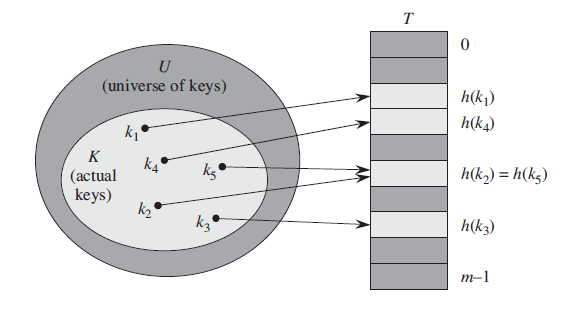
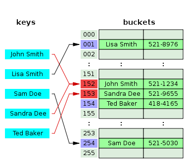
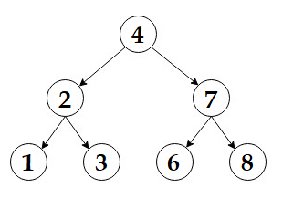
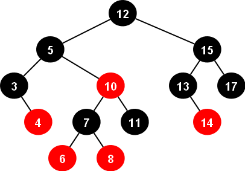

# Introduction to Data Structures - Part II

Authors: **Fatih Semiz, Kaan Keskin**

Date: July 2021

Available at (Source): https://github.com/fsemiz/Introduction-To-Data-Structures

Available at (Forked): https://github.com/kaan-keskin/Introduction-To-Data-Structures

Java Collections Framework Benchmark Tool: https://github.com/kaan-keskin/java-collections-benchmark

**Resources:**

- Introduction to Algorithms - Cormen, Leiserson, Rivest, Stein
- Hash Tables - Yusuf Sahillioğlu (PowePoint Slides)
- Algorithms - Robert Sedgewick, Kevin Wayne
- Grokking Algorithms - Aditya Y. Bhargava
- CSCI 104 Slides - Mark Redekopp, David Kempe, Sandra Batista
- Data Structures and Algorithms in Java - Michael T. Goodrich, Roberto Tamassia, and Michael H. Goldwasser.
- Discrete Mathematics (Freie Universität Berlin) - Gunner Klaus  (PowePoint Slides)
- Wikipedia - www.wikipedia.com
- Purdue University CS251 Slides

### Hash Tables
    Hash Table: A hash table is a data structure that implements an associative array abstract data type, 
    a structure that can map keys to values.
    
|  |
|:--:|
| *This example shows why we need hash tables* |
    
A hash table (hash map) is a data structure that implements an associative array abstract data type, a structure that can map keys to values. A hash table uses a hash function to compute an index, also called a hash code, into an array of buckets or slots, from which the desired value can be found. A hash table generalizes the idea of an simple array in which we can access an ordinary elements position in O(1) time. If number of keys stored is small compared to total number of keys then it is effective to use an hash table. One idea that hash tables use is to compute the key from the index instead of directly using the key.

### Applications of Hash Tables

- File System
	- The hashing is used for the linking of the file name to the path of the file. 
- Password Verification
	- When you use some web service and enter your credentials to log in, a hash value of your password is computed on the client-side and then sent to the server which then compares that hash value with the hash value of the stored password.
- Pattern Matching - The pattern matching is used to detect plagiarism.
- Programming Languages
- Compilers
	- For identifying the keywords in the programming languages, the compiler uses the hash table to store these keywords and other identifiers to compile the program.

An array maps integers to values
+ Given i , array[i] returns the value in O(1)

Dictionaries map keys to values
+ Given key, k, map[k] returns the associated value

|  |
|:--:|
| *Array vs Dictionary* |

Can we use non integer keys but still use an array?
What if we just convert the non integer key to an integer.

**For now, make the unrealistic assumption that each unique key converts to a unique integer. This is the idea behind a hash table.
The conversion function is known as a hash function, h(k) It should be fast/easy to compute (i.e. O(1) )**

    Instead of using the key as an array index directly, the array index is computed from the key.

|  |
|:--:|
| *Array to dictionary conversion* |


**How to implement hast tables ?**

1. *First idea ? A hash table can be implemented with a balanced BST.*

|  |
|:--:|
| *Hash table implementation with a BST* |

A dictionary/map can be implemented with a balanced BST
- Insert, Find, Remove = O(log2n)

Can we do better?
- Hash tables (unordered maps) offer the promise of O(1) access time

2. *Second idea, Direct Access Table*

How to implement a dynamic set by a direct-address table T . Each key in the universe U = {0,1, ..., 9} corresponds to an index in the table. The set K = {2, 3, 5, 8} of actual keys determines the slots in the table that contain pointers to elements. The other slots, heavily shaded, contain NIL.

|  |
|:--:|
| *A direct access table* |

The downside of direct addressing is obvious: if the universe U is large, storing a table T of size |U| may be impractical, or even impossible, given the memory available on a typical computer.

Furthermore, the set K of keys actually stored may be so small relative to U that most of the space allocated for T would be wasted.

3. *Hash Table*

When the set K of keys stored in a dictionary is much smaller than the universe U of all possible keys, a hash table requires much less storage than a direct address table. Specifically, we can reduce the storage requirement to ‚ |K| while we maintain the benefit that searching for an element in the hash table still requires only O(1) time (on average).

|  |
|:--:|
| *Hash Table* |

With direct addressing, an element with key k is stored in slot k. With hashing, this element is stored in slot h(k); that is, we use a hash function h to compute the slot from the key k. Here, h maps the universe U of keys into the slots of a hash table T=[0.. m-1].

*Direct Access Table (timing always good, space terrible) vs. Hash Table (timing good on average, space always good).*

Although searching for an element in a hash table can take as long as searching for an element in a
linked list—O(n) time in the worst case—in practice, hashing performs extremely well. 

    Under reasonable assumptions, the average time to search for an element in a hash table is O(1).


**Hash Function:**

h: U -> {0,1, ... , m-1}, where the size m of the hash table is typically much less than |U|. We say that an element with key k hashes to slot h(k); we also say that h(k) is the hash value of key k.

The hash function:
- must be simple to compute.
- must distribute the keys evenly among the cells.

If we know which keys will occur in advance we can write perfect hash functions, **but we don’t**.

**Types of Hash Functions**

**Positive integers:** The most commonly used method for hashing integers is called modular hashing: we choose the array size M to be prime, and, for any positive integer key k, compute the remainder when dividing k by M. This function is very easy to compute (k % M, in Java), and is effective in dispersing the keys evenly between 0 and M-1.

**Floating-point numbers:** If the keys are real numbers between 0 and 1, we might just multiply by M and round off to the nearest integer to get an index between 0 and M-1. Although it is intuitive, this approach is defective because it gives more weight to the most significant bits of the keys; the least significant bits play no role. One way to address this situation is to use modular hashing on the binary representation of the key (this is what Java does).

**Strings:** Modular hashing works for long keys such as strings, too: we simply treat them as huge integers. For example, the code below computes a modular hash function for a String s, where R is a small prime integer (Java uses 31 - Why 31??? It's prime, so that when the user mods out by another number, they have no common factors (unless it's a multiple of 31). 31 is also a Mersenne prime (like 127 or 8191) which is a prime number that is one less than a power of 2. This means that the mod can be done with one shift and one subtract if the machine's multiply instruction is slow.).

```Java
int hash = 0;
for (int i = 0; i < s.length(); i++)
    hash = (R * hash + s.charAt(i)) % M;
```

**Compound keys:** If the key type has multiple integer fields, we can typically mix them together in the way just described for String values. For example, suppose that search keys are of type USPhoneNumber, which has three integer fields area (3-digit area code), exch (3-digit exchange), and ext (4-digit extension). In this case, we can compute the number

```Java
int hash = (((area * R + exch) % M) * R + ext) % M; 
```
**Java conventions:** Java helps us address the basic problem that every type of data needs a hash function by requiring that every data type must implement a method called hashCode() (which returns a 32-bit integer). The implementation of hashCode() for an object must be consistent with equals. That is, if a.equals(b) is true, then a.hashCode() must have the same numerical value as b.hashCode(). If the hashCode() values are the same, the objects may or may not be equal, and we must use equals() to decide which condition holds.

**Python conventions:** Similarly in python one can implement \_\_hash\_\_() function for objects. And \_\_eq\_\_() for checking equality.

Converting a hashCode() to an array index. Since our goal is an array index, not a 32-bit integer, we combine hashCode() with modular hashing in our implementations to produce integers between 0 and M-1 as follows:

```Java
private int hash(Key key) {
    return (key.hashCode() & 0x7fffffff) % M;
}
```

The code masks off the sign bit (to turn the 32-bit integer into a 31-bit nonnegative integer) and then computing the remainder when dividing by M, as in modular hashing.

**User-defined hashCode():**

We have three primary requirements in implementing a good hash function for a given data type:
- It should be deterministic—equal keys must produce the same hash value.
- It should be efficient to compute.
- It should uniformly distribute the keys.

**Analysis**

|  |
|:--:|
| *An example of a collision - retrieved from: https://commons.wikimedia.org/wiki/File:Hash_table_5_0_1_1_1_1_0_SP.svg* |

Let; *n = number of entries (i.e. keys), m = size of the hash table*

If **n > m** , is every entry in the table used ?
- No. Some may be blank?

Is it possible we haven't had a collision?
- No. Some entries have hashed to the same location

Pigeon Hole Principle says given n items to be slotted into m holes and **n > m** there is at least one hole with more than 1 item
- So if **n > m** , we know we've had a collision
- We can only avoid a collision when **n < m**

|  |
|:--:|
| *Pigeons in holes. Here there are n = 10 pigeons in m = 9 holes. Since 10 is greater than 9, the pigeonhole principle says that at least one hole has more than one pigeon. (The top left hole has 2 pigeons.) - retrieved from: https://en.wikipedia.org/wiki/Pigeonhole_principle* |

**Resolving Collisions**
- Collisions occur when two keys, k<sub>1</sub> and k<sub>2</sub>, are not equal, but h(k<sub>1</sub>) = h(k<sub>2</sub>).
- Collisions are inevitable if the number of entries, n , is greater than table size, m by pigeonhole principle
- Methods
    - Closed Addressing (e.g. buckets or chaining)
    - Open addressing (aka probing)
       - Linear Probing
       - Quadratic Probing
       - Double hashing

**Seperate Chaining**

    The idea is to keep a list of all elements that hash to the same value. 

The array elements are  pointers to the first nodes of the lists.  A new item is inserted to the front of the list.  

||
|:--:|
| *Seperate Chaining* |

*Advantages:*
- Better space utilization for large items.
- Simple collision handling: searching linked list.
- Overflow: we can store more items than the hash table size.
- Deletion is quick and easy: deletion from the linked list

**Operations**

- **Initialization:** all entries are set to NULL
- **Find:**  locate the cell using hash function. sequential search on the linked list in that cell.
- **Insertion:**  Locate the cell using hash function. (If the item does not exist) insert it as the first item in the list.
- **Deletion:** Locate the cell using hash function. Delete the item from the linked list.

**Analysis of Seperate Chaining**

- Collisions are very likely.
   - How likely and what is the average length of lists?
- Load factor l definition:
   - Ratio of number of elements (N) in a hash table to the hash TableSize. i.e.,    l = N/TableSize
– The average length of a list/chain is also l.
- For chaining l is not bound by 1; it can be > 1
- Cost = Constant time to evaluate the hash function + time to traverse the list = constant time + expected chain length
				      = O(1 + l).

*Unsuccessful search:*
We have to traverse the entire list, so we need to compare l nodes on the average.

*Successful search:*
List contains the one node that stores the searched item + 0 or more other nodes.

Expected # of other nodes = x = (N-1)/M which is essentially l, since M is presumed large.

    On the average, we need to check half of the other nodes while searching for a certain element
    Thus average search cost = 1 + l/2
    
**Open Addressing** 
- Separate chaining has the disadvantage of using linked lists.
- Requires the implementation of a second data structure.
- In an open addressing hashing system, all the data go inside the table.
- Thus, a bigger table is needed.
- Generally the load factor should be below 0.5.
- If a collision occurs, alternative cells are tried until an empty cell is found.

There are three common collision resolution strategies:
- Linear Probing
- Quadratic probing 
- Double hashing

**Analysis**
- Open addressing means an item with key, k, may not be located at h(k)
- If location 2 is occupied and a new item hashes to location 2, we need to find another location to store it.
- Let i be number of failed inserts 
- Linear Probing
    - h(k,i) = (h(k)+i) mod m
    - Example: Check h(k)+1, h(k)+2, h(k)+3, …
- Quadratic Probing
    - Quadratic Probing
    - Check location h(k)+1<sup>2</sup>, h(k)+2<sup>2</sup>, h(k)+3<sup>2</sup>, …

If certain data patterns lead to many collisions, linear probing leads to clusters of occupied areas in the table called primary clustering. 

    The problem of Linear Probing = primary clustering.
    
**Quadratic probing tends to spread out data across the table by taking larger and larger steps until it finds an empty location.**

**Find and Removal**

First hash it
- If it is not at h(k), then move on to the next items in the linear or quadratic sequence of locations until 
   - you find it or 
   - an empty location or
   - search the whole table

What if items get removed
- Now the find algorithm might terminate  too early
– Mark a location as "removed"=unoccupied but part of a cluster

**Double Hashing (Rehashing):**

	Double hashing is a technique used for avoiding collisions in hash tables.

A second hash function is used to drive the collision resolution.

The idea: Make the offset to the next position probed depend on the key value, so it can be different for different keys.

An example of double hashing:

```
(firstHash(key) + i * secondHash(key)) % tableSize 
```
The value of **i** will keep incrementing (the offset will keep increasing) until an empty slot is found.

- Double hashing is useful if an application requires a smaller hash table since it effectively finds a free slot.
- Althought the computational cost may be high, double hashing can find the next free slot faster than the linear probing approach.

**Universal Hashing**

No matter how we choose our hash function, it is always possible to devise a set of keys that will hash to the same slot, making the hash scheme perform poorly.

To overcome this issue, we randomize the choice of a hash function from a carefully designed set of functions.

Let &#934; be a finite collection of hash functions that map a given universe U of keys into the range {0,1,2,...,m−1}.

&#934; is called universal if for each pair of distinct keys x,y &#8712; U, 

The number of hash functions h &#8712; &#934; for which h(x) = h(y) is precisely equal to 
|&#934;|/m.

With a function randomly chosen from &#934;, the chance of a collision between x and y where x &#8800; y is exactly 1/m.

**Theorem.** If h is chosen from a universal class of hash functions and is used to hash n keys into a table of size m, where n ≤ m, the expected number of collisions
involving a particular key x is less than 1.

#### Running Times for Common Operations in Hash Tables

| Algorithm |  Average |  Worst case |
|:---------:|----------|-------------|
|   Space   |  O(n)    |  O(n)       |
|   Search  |  O(1)    |  O(n)       |
|   Insert  |  O(1)    |  O(n)       |
|   Delete  |  O(1)    |  O(n)       |

The reasons why most Hash tables suffer from O(n) worst time complexity:
- When too many elements were hashed into the same key.
	- Searching the list in a key may take O(n) time in this case.
- Once a hash table passes its load balance 
 	- It has to rehash (create a new bigger table, and re-insert each element to the table). 

*The worst case can be reduced from O(n) to O(log n) by using a more complex data structure within each bucket (rather than linked list).*

The reasons why Hash tables has a O(1) average case complexity (amortized case):
- It is very rare that many items will be hashed to the same key 
 	- If you chose a good hash function and you don't have too big load balance.
- The rehash operation, which is O(n), can at most happen after n/2 operations, which are all assumed O(1): 
 	- Thus when you sum the average time per operation, you get : (n*O(1) + O(n)) / n) = O(1)
 
 #### Hash Tables in Java Programming Language
 
Hashtable implements Serializable, Cloneable, Map<K,V> interfaces and extends Dictionary<K,V>. The direct subclasses are Properties, UIDefaults.

|  |
|:--:|
| *The Hierarchy of Hashtable - retrieved from https://www.geeksforgeeks.org/hashtable-in-java/* |

- Any non-null object can be used as a key or as a value. 
- To successfully store and retrieve objects from a hashtable, the objects used as keys must implement the **hashCode** method and the **equals** method.  
- To create a Hashtable, it has to be imported from **java.util.Hashtable**.

In java, a hash table can be created in the following ways:
```Java
1- Hashtable<K, V> ht = new Hashtable<K, V>();
2- Hashtable<K, V> ht = new Hashtable<K, V>(int initialCapacity);
3- Hashtable<K, V> ht = new Hashtable<K, V>(int size, float fillRatio);
4- Hashtable<K, V> ht = new Hashtable<K, V>(Map m);
```
**K** is the type of keys maintained by this map, **V** is the type of mapped values

The first line creates an empty hashtable. 
- The default load factor of 0.75 and the default initial capacity of the hash table is 11. 

Second line creates an empty hashtable where the initial capacity is provided by the parameter.
- The default load factor is 0.75.

The third line creates an empty hashtable with the provided initial capacity and the load factor.

The fourth line creates a hash table that is initialized with the elements in m.

A basic java code with the basic operations on Hash Tables:
```Java
// Java program to illustrate basic operations with hash tables
  
import java.util.Hashtable;
import java.util.Map;
  
public class IteratingHashtable {
    public static void main(String[] args)
    {
          // Create an instance of Hashtable
        Hashtable<String, Integer> ht = new Hashtable<>();
  
          // Adding elements using put method
        ht.put(1, "ali");
        ht.put(3, "veli");
        ht.put(2, "deli");
	
	// Update the value at key 2
       ht.put(2, "Veli");

          // Remove the map entry with key 4
        ht.remove(1);
	
          // Iterating using enhanced for loop
        for (Map.Entry<String, Integer> e : ht.entrySet())
            System.out.println(e.getKey() + " "
                               + e.getValue());
    }
}
```
The output is:
```
3 Veli
2 deli
```
 #### Hash Tables in Python Programming Language
Python dictionaries are implemented as **hash tables**.
- It stores values using a pair of keys and values. 
- The hash values are automatically generated, and any collisions are resolved in the background.
- Python uses c implementation for hash tables and the implementation can be found at: [code](https://hg.python.org/cpython/file/52f68c95e025/Objects/dictobject.c#l296) 
- Python dict uses open addressing to resolve hash collisions (explained below).  (see dictobject.c:296-297 from the code).
- When a new dict is initialized it starts with 8 slots. (see dictobject.h:49 from the [code](https://hg.python.org/cpython/file/52f68c95e025/Include/dictobject.h#l64))
- CPython uses random probing. In random probing, the next slot is picked in a pseudo random order. The entry is added to the first empty slot.(see dictobject.c:33-126 for the algorithm for probing).
- The dict will be resized if it is two-thirds full. This avoids slowing down lookups. (see dictobject.h:64-65)
- When adding entries to the table, we start with some slot, i, that is based on the hash of the key. CPython initially uses i = hash(key) & mask (where mask = PyDictMINSIZE - 1). Te initial slot, i, that is checked depends on the hash of the key.

The following example shows the basic hash table operations in python3:
```Python
#Define a dictionary in which the keys are 'name', 'age' and 'position'
#'John Doe', '36' and 'Business Manager' are the values
employee = {
    'name': 'John Doe',
    'age': 36,
    'position': 'Business Manager.'
}

#Retrieves and prints the value of the key 'name'
print (f"The name of the employee is {employee['name']}")

#Updates the vaule of the key 'position'
employee['position'] = 'Software Engineer'

print (f"The position of {employee['name']} is {emploonyee['position']}")

#Clears the hash table
employee.clear()

#Prints out the values after the 'clear' action
print (employee)
```
The output is:
```
The name of the employee is John Doe.
The position of John Doe is a Software Engineer.
{}
```

# Trees

	A tree data structure can be defined recursively as a collection of nodes (starting at a root node), where each node is a
	data structure consisting of a value, together with a list of references to nodes (the "children"), with the constraints 
	that no reference is duplicated, and none points to the root.

|  |  |
|------------|-------------|
| A visual tree representation ([image](https://medium.com/swlh/making-data-trees-in-python-3a3ceb050cfd))   | Tree definitions     |

- A tree is a collection of entities called nodes. 
- Nodes are connected by edges. Each node contains a value or data, and it may or may not have a child node .
- A root node, r, that has 0 or more subtrees.
- Exactly one path between any two nodes.
- Nodes have exactly one parent (except for the root) and 0 or more children
- Arrays, linked-lists, queues and stacks are all **linear data structures** but trees are not.
- In **non-linear data structures**, the data doesn’t really follow an order. And because the data doesn’t necessarily need to be arranged in a particular order, it’s easy (and actually pretty common) to traverse a non-linear data structure in a non-sequential manner.

|  |  |
|------------|-------------|
| Trees are recursive data structures!      | File systems are example of trees. ([image](https://medium.com/basecs/how-to-not-be-stumped-by-trees-5f36208f68a7))       |


### Applications of Trees
- XML Parser uses tree algorithms.
- Decision-based algorithm is used in machine learning which works upon the algorithm of tree.
- Databases also uses tree data structures for indexing.
- Domain Name Server(DNS) also uses tree structures.
- File explorer/my computer of mobile/any computer
- BST used in computer Graphics
- In robotics and planning trees are used to store the possible states of the solution space. Algorithms generally traverses that tree to find the solution.


## Java Tree Implementation

Implementing a tree with basic operations:
```Java
import java.util.ArrayList;

public class TreeNode {
    public String LABEL;
    public ArrayList<TreeNode> children;
    
    public TreeNode(String LABEL) {
        this.LABEL = LABEL;
        children = new ArrayList<>();
    }
    
    public boolean addChild(String label) {
        return children.add(new TreeNode(label));
    }
    
    public ArrayList<TreeNode> getChildren() {
        return new ArrayList<>(children);
    }
   
}
```

Usage:

```Java
class TestGeneralTree {
    public static void main(String[] args) {
        TreeNode root = new TreeNode("root node");
        
        root.addChild("child1");
        root.addChild("child2");
        
        root.children.get(0).addChild("child3");
    }
}
```

## Python Tree Implementation

Implementing a tree with basic operations:
```Python
class Tree:
    def __init__(self, data):
        self.children = []
        self.data = data
```

Usage:

```Python
children1 = Tree("children1")
children2 = Tree("children2")
children3 = Tree("children3")

children2.children = [children3]

root = Tree("root node")
root.children = [children1, children2]
```

- **N-ary trees:** Tree where each node has at most n children.
- **Binary trees:** Binary tree = N-ary Tree with n=2

## Binary trees:

Full binary tree: a binary tree, T, where:

- Full binary tree is a binary tree in which every node has 0 or 2 children.
- If height h==0, then it is full by definition


Complete binary tree 

- Tree where levels 0 to h-1 are full and level h is filled from left to right
 
 
Balanced binary tree 			

- Tree where subtrees from any node differ in height by at most 1


 
## Binary Tree Traversals

Unlike linear data structures (Array, Linked List, Queues, Stacks, etc.) which have only one logical way to traverse them, trees can be traversed in different ways. Pre-order, in-order and post-order traversals are the generally used ways for traversing trees.  

- **Pre-order** Process root then visit subtrees 
- **In-order** Visit left subtree, process root, visit right subtree
- **Post-order** Visit left subtree, visit right subtree, process root
 


## Priority Queues
	In a priority queue, an element with high priority is served before an element with low priority.

Priority queue: Remove the largest (or smallest) item.

A priority queue can be implemented as:
- Binary Search Tree
- Linked List
- Array


Priority queue applications:
- Event-driven simulation. [ customers in a line, colliding particles ]
- Numerical computation. [ reducing roundoff error ]
- Data compression. [ Huffman codes ]
- Graph searching. [ Dijkstra's algorithm, Prim's algorithm ]
- Number theory. [ sum of powers ]
- Artificial intelligence. [ A* search ]
- Statistics. [ online median in data stream ]
- Operating systems. [ load balancing, interrupt handling ]
- Computer networks. [ web cache ]
- Discrete optimization. [ bin packing, scheduling ]
- Spam filtering. [ Bayesian spam filter ]


| data type      | key operations        | data structure              |
|----------------|-----------------------|-----------------------------|
| stack          | PUSH, POP             | linked list, resizing array |
| queue          | ENQUEUE, DEQUEUE      | linked list, resizing array |
| **priority queue** | **INSERT, DELETE-MAX**    | **binary heap**                 |
| symbol table   | PUT, GET, DELETE      | BST, hash table             |
| set            | ADD, CONTAINS, DELETE | BST, hash table             |

## Heaps

	A heap is a data structure - specifically, a rooted, nearly complete binary tree - where the key of the root is greater 
	than the key of either of its children, and this is recursively true for the subtree rooted at each child. 

Nearly complete means that the tree is completely filled except possibly on the lowest level, which is filled from left to right.

Can think of heap as a complete binary tree with the property that every parent is less-than (if min-heap) or greater-than (ifmax-heap) both children
– But no ordering property between children

Provides an efficient implementation for a priority queue.

|  |
|:--:|
| *Min Heap* |

Many applications require that we process records with keys in order, but not necessarily in full sorted order.

It is a common need to collect a set of items and process the one with the current minimum/maximum value.
	- One Common Example: Operating systems to schedule jobs

|  |
|:--:|
| *Representing heaps with arrays* |


**Binary heap:** Array representation of a heap-ordered complete binary tree.
- Parent's key no smaller than children's keys.

Array representation:
- Indices start at 1.
- Take nodes in level order.
- No explicit links needed!

Largest key is a[1], which is root of binary tree.

Can use array indices to move through tree.
- Parent(i) = i/2
- Left_child(p) = 2*p
- Right_child(p) = 2*p + 1

## Push Heap

Add item to first free location at bottom of tree:
- Recursively promote it up while it is less than its parent
– Remember valid heap all parents < children
- so we need to promote it up until that property is satisfied

|  |
|:--:|
| *Push heap example* |

## Pop Heap
Takes last (greatest) node puts it in the top location and then recursively swaps it for the smallest child until it is in its right place

|  |
|:--:|
| *Pop heap example* |


## Java Heap Implementation
```Java
// Java implementation of Min Heap
public class MinHeap {
    private int[] Heap;
    private int size;
    private int maxsize;
 
    private static final int FRONT = 1;
 
    public MinHeap(int maxsize)
    {
        this.maxsize = maxsize;
        this.size = 0;
        Heap = new int[this.maxsize + 1];
        Heap[0] = Integer.MIN_VALUE;
    }
 
    // Function to return the position of
    // the parent for the node currently
    // at pos
    private int parent(int pos)
    {
        return pos / 2;
    }
 
    // Function to return the position of the
    // left child for the node currently at pos
    private int leftChild(int pos)
    {
        return (2 * pos);
    }
 
    // Function to return the position of
    // the right child for the node currently
    // at pos
    private int rightChild(int pos)
    {
        return (2 * pos) + 1;
    }
 
    // Function that returns true if the passed
    // node is a leaf node
    private boolean isLeaf(int pos)
    {
        if (pos >= (size / 2) && pos <= size) {
            return true;
        }
        return false;
    }
 
    // Function to swap two nodes of the heap
    private void swap(int fpos, int spos)
    {
        int tmp;
        tmp = Heap[fpos];
        Heap[fpos] = Heap[spos];
        Heap[spos] = tmp;
    }
 
    // Function to heapify the node at pos
    private void minHeapify(int pos)
    {
 
        // If the node is a non-leaf node and greater
        // than any of its child
        if (!isLeaf(pos)) {
            if (Heap[pos] > Heap[leftChild(pos)]
                || Heap[pos] > Heap[rightChild(pos)]) {
 
                // Swap with the left child and heapify
                // the left child
                if (Heap[leftChild(pos)] < Heap[rightChild(pos)]) {
                    swap(pos, leftChild(pos));
                    minHeapify(leftChild(pos));
                }
 
                // Swap with the right child and heapify
                // the right child
                else {
                    swap(pos, rightChild(pos));
                    minHeapify(rightChild(pos));
                }
            }
        }
    }
 
    // Function to insert a node into the heap
    public void insert(int element)
    {
        if (size >= maxsize) {
            return;
        }
        Heap[++size] = element;
        int current = size;
 
        while (Heap[current] < Heap[parent(current)]) {
            swap(current, parent(current));
            current = parent(current);
        }
    }
 
    // Function to print the contents of the heap
    public void print()
    {
        for (int i = 1; i <= size / 2; i++) {
            System.out.print(" PARENT : " + Heap[i]
                             + " LEFT CHILD : " + Heap[2 * i]
                             + " RIGHT CHILD :" + Heap[2 * i + 1]);
            System.out.println();
        }
    }
 
    // Function to remove and return the minimum
    // element from the heap
    public int remove()
    {
        int popped = Heap[FRONT];
        Heap[FRONT] = Heap[size--];
        minHeapify(FRONT);
        return popped;
    }
 ```
 
 Usage: 
 ```Java
    // Driver code
    public static void main(String[] arg)
    {
        System.out.println("The Min Heap is ");
        MinHeap minHeap = new MinHeap(15);
        minHeap.insert(5);
        minHeap.insert(3);
        minHeap.insert(17);
        minHeap.insert(10);
        minHeap.insert(84);
        minHeap.insert(19);
        minHeap.insert(6);
        minHeap.insert(22);
        minHeap.insert(9);
 
        minHeap.print();
        System.out.println("The Min val is " + minHeap.remove());
    }
```

## Python Heap Implementation

```Python

class MinHeap:
    def __init__(self):
        """
        On this implementation the heap list is initialized with a value
        """
        self.heap_list = [0]
        self.current_size = 0
 
    def sift_up(self, i):
        """
        Moves the value up in the tree to maintain the heap property.
        """
        # While the element is not the root or the left element
        while i // 2 > 0:
            # If the element is less than its parent swap the elements
            if self.heap_list[i] < self.heap_list[i // 2]:
                self.heap_list[i], self.heap_list[i // 2] = self.heap_list[i // 2], self.heap_list[i]
            # Move the index to the parent to keep the properties
            i = i // 2
 
    def insert(self, k):
        """
        Inserts a value into the heap
        """
        # Append the element to the heap
        self.heap_list.append(k)
        # Increase the size of the heap.
        self.current_size += 1
        # Move the element to its position from bottom to the top
        self.sift_up(self.current_size)
 
    def sift_down(self, i):
        # if the current node has at least one child
        while (i * 2) <= self.current_size:
            # Get the index of the min child of the current node
            mc = self.min_child(i)
            # Swap the values of the current element is greater than its min child
            if self.heap_list[i] > self.heap_list[mc]:
                self.heap_list[i], self.heap_list[mc] = self.heap_list[mc], self.heap_list[i]
            i = mc
 
    def min_child(self, i):
        # If the current node has only one child, return the index of the unique child
        if (i * 2)+1 > self.current_size:
            return i * 2
        else:
            # Herein the current node has two children
            # Return the index of the min child according to their values
            if self.heap_list[i*2] < self.heap_list[(i*2)+1]:
                return i * 2
            else:
                return (i * 2) + 1
 
    def delete_min(self):
        # Equal to 1 since the heap list was initialized with a value
        if len(self.heap_list) == 1:
            return 'Empty heap'
 
        # Get root of the heap (The min value of the heap)
        root = self.heap_list[1]
 
        # Move the last value of the heap to the root
        self.heap_list[1] = self.heap_list[self.current_size]
 
        # Pop the last value since a copy was set on the root
        *self.heap_list, _ = self.heap_list
 
        # Decrease the size of the heap
        self.current_size -= 1
 
        # Move down the root (value at index 1) to keep the heap property
        self.sift_down(1)
 
        # Return the min value of the heap
        return root	
```

Usage:

```Python
"""
Driver program
"""
# Same tree as above example.
my_heap = MinHeap()
my_heap.insert(5)
my_heap.insert(6)
my_heap.insert(7)
my_heap.insert(9)
my_heap.insert(13)
my_heap.insert(11)
my_heap.insert(10)

print(my_heap.delete_min()) # removing min node i.e 5 
```

## Binary Search Tree 

Binary Search Tree is a node-based binary tree data structure which has the following properties:

- The left subtree of a node contains only nodes with keys lesser than the node’s key.
- The right subtree of a node contains only nodes with keys greater than the node’s key.
- The left and right subtree each must also be a binary search tree.

## Binary Search Tree Definition with Java

```Java
class Node {
    int value;
    Node left;
    Node right;

    Node(int value) {
        this.value = value;
        right = null;
        left = null;
    }
}

private Node addRecursive(Node current, int value) {
    if (current == null) {
        return new Node(value);
    }

    if (value < current.value) {
        current.left = addRecursive(current.left, value);
    } else if (value > current.value) {
        current.right = addRecursive(current.right, value);
    } else {
        // value already exists
        return current;
    }

    return current;
}

public void add(int value) {
    root = addRecursive(root, value);
}
```

Usage:

```Java
private BinaryTree createBinaryTree() {
    BinaryTree bt = new BinaryTree();

    
    bt.add(4);
    bt.add(2);
    bt.add(7);
    bt.add(8);
    bt.add(6);
    bt.add(3);
    bt.add(1);

    return bt;
}
```

The visualisation of the resulting tree is:




## Binary Search Tree Definition with Python

 ```Python  
class Node:
    def __init__(self, key):
        self.left = None
        self.right = None
        self.val = key
 
def insert(root, key):
    if root is None:
        return Node(key)
    else:
        if root.val == key:
            return root
        elif root.val < key:
            root.right = insert(root.right, key)
        else:
            root.left = insert(root.left, key)
    return root
```
Usage:

```Python 
r = Node(4)
r = insert(r, 7)
r = insert(r, 2)
r = insert(r, 6)
r = insert(r, 3)
r = insert(r, 8)
r = insert(r, 1)
 ```

## Red Black Trees

	In computer science, a red–black tree is a kind of self-balancing binary search tree. Each node stores an extra 
	bit representing "color" ("red" or "black"), used to ensure that the tree remains balanced during insertions and deletions.

By constraining the node colors on any simple path from the root to a leaf, red-black trees ensure that no such path is more
than twice as long as any other, so that the tree is **approximately balanced**.

A red-black tree is a binary tree that satisfies the following red-black properties:
- Every node is either red or black.
- The root is black.
- Every leaf (NIL) is black.
- If a node is red, then both its children are black.
- For each node, all simple paths from the node to descendant leaves contain the
same number of black nodes.

|  |
|:--:|
| *Red Black Trees* |

## BST vs Red Black Trees:
- BST - Binary Search Tree in worst can can have a complexity of O(n) in insert, delete (see example below).
- The Red-Black trees guarantee a O(log(n)) in insert, delete (even in worst case). 
- They are balanced search trees and therefore balance themselves to always maintain a height of log(n).
- Consider inserting 1,2,3,4,5 into a binary search tree. It’ll make 1 as the root and all the following elements would keep going to the right thus forming a linked list in essence (and each operation thus taking O(n) time).
- Average time complexity may be the same, but if we consider the worst case, the time complexity of red black trees is better than binary search trees.

# AVL Trees

	An AVL Tree is a binary search tree such that for every internal node v of T, the heights of the 
	children of v can differ by at most 1.
	
- Named after inventors Georgy **A**delson-**V**elsky and Evgenii **L**andis
- Is a self-balancing binary search tree. 
- The height of an AVL tree T storing n keys is O(log n)
- After each instertion and deletion, balancing operations must be performed.

An example of an AVL tree where the heights are shown next to the nodes:
|  |
|:--:|
| *AVL Trees* |

## AVL Trees vs Red Black Trees:
- AVL trees provide faster lookups than Red Black Trees because they are more strictly balanced.
- Red Black Trees provide faster insertion and removal operations than AVL trees as fewer rotations are done due to relatively relaxed balancing.
	- To keep the tree balanced AVL trees does more CPU instructions per operation (insert/delete) at average.
- AVL trees store the balance factor at each node. This takes O(N) extra space.
-  However, if we know that the keys that will be inserted in the tree will always be greater than zero, we can use the sign bit of the keys to store the colour information of a red-black tree. Thus, in such cases red-black tree takes no extra space.
- Red Black Trees are used in most of the language libraries like map, multimap, multiset in C++ whereas AVL trees are used in databases where faster retrievals are required.
- Thus for a look-up intensive task using an AVL tree is advantageous.
- For an insert intensive tasks, using a Red-Black tree is adventageous.
